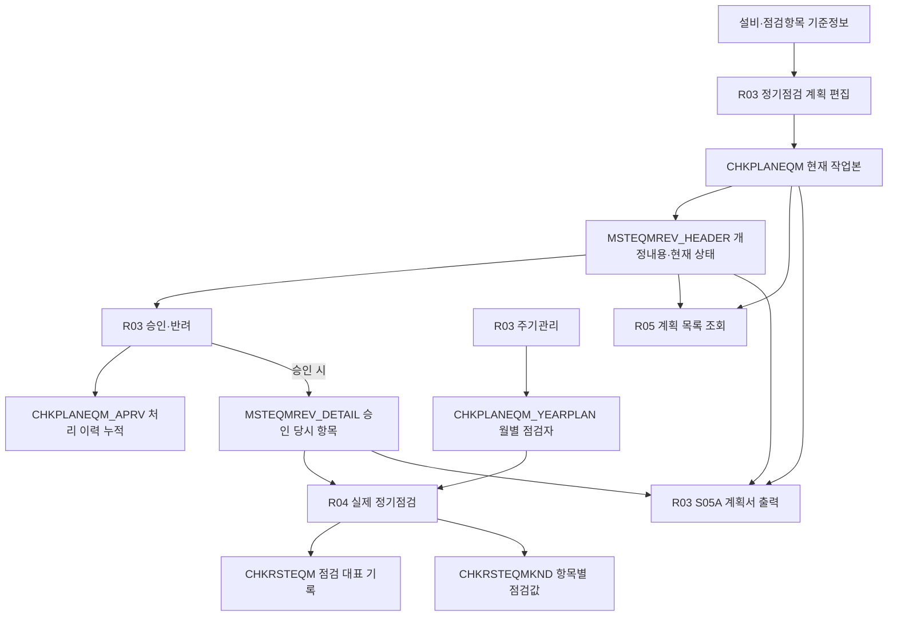

# EQM1001 기능·프로시저·테이블 작업 정리

대상 기간: 2026-10-06~2026-10-07. 최초 분석은 반려 재요청 수정 전 소스 기준이며, 아래 마지막 절에 2026-10-07 재요청 개선 결과를 추가했다.

아래 최초 분석과 REV.0 설명은 수정 전 기록이다. 마지막 절의 재요청 개선 내용이 이번 로컬 소스의 최신 동작이며, 실제 서버 프로시저 반영 여부와는 구분한다. 최초 분석에서 지적한 출력 파라미터·전체 REV 조회 문제는 이번 반려 재요청 수정 범위에 포함하지 않았다.

## 반려 재요청 수정 전 소스 분석 기록

현재 R03 자바스크립트에는 오늘의 선택 유지·중복 조회 제거 수정이 남아 있지만, R03 SQL 일부는 작업 이력의 최종 내용보다 이전 형태다. 파일이 되돌아간 원인이나 실제 서버의 버전은 이번 분석만으로 확정할 수 없다.

- 설비별 목록 `LIST_MSTEQM`: REV 번호는 마지막 승인 REV, 상태는 최신 REV를 사용한다. REV가 없는 경우도 `대기`로 표시한다. 최종 요구인 “번호·상태 모두 최신 REV, REV 없으면 상태 공란”과 다르다. 그룹 목록은 REV 없음 공란 처리가 있다.
- `SAVE_PLAN_REV`: 개정내용·요청자·요청일시는 저장하지만 APRVSTT·REJREASON·처리정보를 초기화하지 않는다. 현재 SQL대로면 반려된 REV의 개정내용을 저장해도 반려가 유지된다.
- 정기점검 CRUD 공통 REV 처리: CASE 실행 전에 동작하며, 대상의 모든 미승인 REV를 대기로 바꾼다. 최종 작업 이력에 있는 “실제 변경 성공 후 최신 REV만 처리”와 다르다. 항목 변경이 없는 성공 요청에서도 상태·REV가 변할 여지가 있다.
- `SAVE_PLAN_STATUS`: 선택 대상이 최신 REV인지는 검사하지만, 소속 설비 반려 검사·승인본 INSERT·승인이력 INSERT·HEADER UPDATE에는 최신 REV 제한이 없다. 과거 미승인 REV까지 처리될 수 있어 “대상별 최신 REV만 일괄 처리”와 다르다.
- `LIST_PLAN_REV`: JS는 CRUD 후 `REVNUM='LATEST'`를 보낸다. 현재 SQL은 REVNUM을 조회 조건에 사용하지 않고 전체 REV를 내림차순 반환한다. JS가 첫 행을 사용하므로 최신 데이터는 취득하지만 단건 조회 최적화는 적용되지 않았다.
- `CALL_PLAN_RPT`: JS와 S05A는 PLANTP·PLANCD만 전송하지만 SQL은 숫자 REVNUM을 필수로 검사한다. 현재 파일끼리 사용하면 출력 검증 조건이 맞지 않는다. 이력 SELECT에도 선택 REV 이하, 승인 또는 선택 REV, LIMIT 4 조건이 남아 있다. 최종 요구인 “선택 대상의 최신 계획·전체 REV의 최종 상태 한 건씩 출력”과 다르다.
- 복사 SQL: 현재 공통 사전 검증은 원본 선택 여부만 검사한다. 그룹 복사는 원본 항목 없음 검증이 있으나 동일 그룹 검증은 없다. 설비 복사는 대상 삭제 전 원본 항목 없음·동일 설비 검증이 없다. 작업 이력에 있는 보완과 차이가 있다.

따라서 아래의 “최종 업무 흐름”은 확정된 요구사항 설명이며, 현재 구현과 차이가 있는 부분은 해당 절에서 다시 표시한다. 이 문서를 근거로 현재 서버에도 모두 구현됐다고 판단하면 안 된다.

## 전체 업무 흐름

R03은 “무엇을 점검할지와 어느 달 누가 점검할지”를 관리한다. R04는 “승인된 항목으로 실제 점검하고 결과를 기록하는 화면”이다. R05는 이전에 승인 기능을 담당했으나 현재 소스는 두 탭의 계획 목록 조회만 담당한다. 승인·반려·출력은 R03의 REV 영역으로 이동했다.

핵심 구분은 현재 계획, 리비전 상태, 승인 당시 항목, 승인 처리 로그, 월별 일정, 실제 점검 결과다. 비슷해 보여도 저장하는 질문이 다르다.

## 테이블별 역할과 연결키

### MSTEQM — 설비 기준정보

설비코드 `FANO`, 설비명 `EQMNM`, 설비그룹코드 `EQMGUBUN`, 사용여부 `USEYN`, 등급 `EQMGRADE`, 규격·라인·공정 등의 원본이다. 계획의 `EQMCD`와 실적의 `EQMCD`는 이 테이블의 FANO에 연결한다.

그룹 CRUD 범위는 그룹명 CNC 같은 표시문자가 아니라 `MSTEQM.EQMGUBUN = 선택한 그룹코드`다. 동일 이름에 여러 코드가 있으면 각각 다른 관리 대상이다.

### COMTYPE — 공통 코드명과 정렬 기준

`GPCD='FM116'`과 `TPCD=EQMGUBUN`으로 그룹 이름 `TPNM`과 정렬순서 `SORTNO`를 구한다. SQL에 이미 FM116이라는 조건이 있어도 실제 그룹명을 출력하거나 정렬할 때는 이 참조가 필요하다. 그룹코드 자체로 필터링만 할 때는 MSTEQM의 EQMGUBUN을 직접 사용한다.

설비등급·공정·수리유형·점검방법 등도 공통 코드 체계를 사용한다. GPCD 함수는 코드명을 반환하는 공통 기능이며 별도의 업무 저장 테이블이 아니다.

### MSTCHKKND — 점검항목 기준정보

`CHKKNDCD`가 점검항목 코드다. 점검명 `CHKKNDNM`, 항목 위치 `CHKLOC`, 방법 `CHKMTH`, 값 구분 `CHKVALTP`, 점검구분 `CHKTP` 등을 정의한다. 정기점검 관리에서 사용하는 구분은 `02`다.

이 테이블은 “점검항목 004의 내용이 무엇인가”를 정의한다. “어느 설비에 004를 적용하는가”는 CHKPLANEQM이 담당한다.

### CHKPLANEQM — 현재 수정하는 설비별 점검계획

설비코드 EQMCD와 항목코드 CHKKNDCD로 설비에 적용할 점검항목을 연결한다. CHKTP, CHKCYCLE, SORTNO, USEYN, REMARK 등을 저장한다.

그룹 전용 항목 테이블을 따로 만들지 않았다. 그룹 추가·저장·삭제는 소속 사용 설비들의 CHKPLANEQM 행을 일괄 변경한다. 그룹 목록의 항목은 소속 설비 항목을 CHKKNDCD별로 합쳐 보여주는 결과다.

따라서 그룹 화면에 항목 하나가 보인다고 모든 설비에 그 항목이 이미 있다는 뜻은 아니다. 그룹 추가 팝업은 전체 설비에 등록되지 않은 항목도 보충할 수 있도록 등록 설비 수를 비교한다.

CHKPLANEQM의 USEYN은 항목 사용여부다. MSTEQM의 USEYN은 설비 사용여부다. 두 값은 서로 다른 조건이다. 편집 화면은 항목 USEYN=N도 보여줄 수 있으며, 승인본 생성 시에는 항목 USEYN=Y를 사용한다.

### MSTEQMREV_HEADER — REV별 신분과 현재 상태

`REVCD`는 GETKEY('REVCD')로 만드는 리비전키이며 PK다. `PLANTP·PLANCD·REVNUM`은 계획별 리비전을 구분하는 UNIQUE 키다.

- PLANTP=G: PLANCD에는 설비그룹코드 EQMGUBUN을 저장한다.
- PLANTP=E: PLANCD에는 설비코드 FANO를 저장한다.
- REVNUM=0: 최초 제정. 다음 개정은 1, 2 등의 번호다.
- APRVSTT='': 리비전이 실제 존재하면 대기. A는 승인, R은 반려다.
- REMARK: 개정내용. 점검항목 비고와 다른 값이다.
- REQEMP·REQTIME·REQPRG: 요청자·요청일시·요청프로그램.
- APRVEMP·APRVTIME·APRVPRG: 승인자 및 승인·반려 처리정보.
- REJREASON: 현재 반려사유.
- REMP·RTIME·RPRG: 행을 최초 등록한 사람·시각·프로그램.
- MEMP·MTIME·MPRG: 마지막 수정 감사정보.

등록자 REMP와 실제 점검자 EMPCD는 역할이 다르다. 요청자 REQEMP도 등록자와 항상 같다고 가정하지 않는다.

REV가 없어서 JOIN 결과가 NULL인 경우와 REV는 있는데 APRVSTT가 빈 경우를 구분해야 한다. R03의 최종 표시 기준은 전자는 공란, 후자는 대기다.

### MSTEQMREV_DETAIL — 승인 당시 항목 내용

승인 시 사용 중인 현재 계획을 복사해 두는 승인본이다. PK는 `REVCD·CHKKNDCD`다. 승인 당시 점검명, 위치, 방법, 값 구분, 순서, 주기, 비고를 저장한다.

PLANTP·PLANCD·REVNUM·EQMCD는 HEADER에서 알 수 있으므로 최신 생성 DDL에서는 DETAIL에 두지 않는다. 설비·그룹은 HEADER의 REVCD 연결로 확인한다.

이 테이블이 필요한 이유는 현재 CHKPLANEQM이나 MSTCHKKND를 바꾸더라도 과거 승인 계획을 다시 볼 수 있어야 하기 때문이다. R04는 신규 편집 중인 계획이 아니라 이 승인본으로 실제 점검을 시작한다.

단, 미승인 REV마다 별도의 편집 항목을 저장하는 테이블은 아니다. 승인될 때 생성하는 구조이므로 과거 반려·대기 REV의 당시 항목을 완전히 재현할 수 있다고 설명하면 안 된다. 또한 코드의 표시명은 GPCD로 변환하므로 코드명 변경까지 모두 동결하는 것은 아니다.

### CHKPLANEQM_APRV — 승인·반려 처리 기록

`APRVKEY`는 GETKEY('APRVKEY')로 발번하는 이력 PK다. REVCD로 처리한 REV를 연결하며, 같은 REV에 여러 기록을 저장할 수 있다. A/R 상태, 요청정보, 처리자·시간, 반려사유를 누적한다.

HEADER는 그 REV의 현재 상태 한 개를 관리한다. APRV는 누가 언제 반려하거나 승인했는지 각각의 사건을 보관한다. 따라서 HEADER와 역할이 다르다.

대기 버튼이나 대기 상태코드 저장은 사용하지 않는다. R05 필터의 W는 “대기 조건으로 검색”하기 위한 화면 값이며 HEADER에 W를 저장하는 코드가 아니다.

### CHKPLANEQM_YEARPLAN — 연도·설비별 월별 점검자

설비 EQMCD, YEAR, CHKTP 및 MONTH_01~MONTH_12에 월별 예정 점검자를 저장한다. 현재 저장 기준은 사원코드이며 조회에서는 사원명을 표시한다. R03의 M01~M12는 표시값, M01CD~M12CD는 저장값을 구분한다.

“이 설비를 3월에 누가 점검할 것인가”를 저장한다. 점검항목·승인상태·실제 측정 결과를 저장하는 테이블이 아니다.

### CHKRSTEQM / CHKRSTEQMKND — 실제 점검 결과

CHKRSTEQM은 CHKRSTKEY로 점검 한 건을 식별한다. EQMCD, 점검일 BASEDATE, 실제 점검자 EMPCD, 문제점 PROBLEM, 조치 SOLUTION, 사용한 승인 리비전키 REVCD를 저장한다.

CHKRSTEQMKND는 CHKRSTKEY와 CHKKNDCD로 항목별 결과를 연결한다. 점검명·방법·값 구분·실제 입력값 CHKVALUE·정렬순서 등을 저장한다.

계획의 승인본과 실적의 항목 기록도 역할이 다르다. 승인본은 무엇을 점검하도록 정했는지, 실적은 그날 실제 어떤 결과를 입력했는지다. 이후 새 REV가 승인돼도 이미 등록한 실적의 REVCD는 그대로 남는다.

### MSTEMP / MSTLINE / MSTCUST / EQMREP / EQMREP_EMP

MSTEMP는 사원코드 EMPCD와 이름 EMPNM의 원본이다. REV 작성자·승인자 이름 변환, 월별 예정 점검자와 실제 점검자 선택, 수리 작업자 표시 등에 사용한다.

MSTLINE은 계획서의 라인명, MSTCUST는 설비이력카드의 구입회사명을 구하는 기준정보다.

EQMREP는 R01의 설비수리 대표 기록이다. EQMREPKEY로 한 수리 건을 식별한다. EQMREP_EMP는 그 수리에 참여한 여러 작업자를 EQMREPKEY·EMPCD로 연결한다. 이 수리 테이블들은 정기점검 CHKRSTEQM 계열과 분리되어 있다.

## MES_SNS2_EQM1001_R03.sql — 점검계획 등록·REV·주기관리

파일: [MES_SNS2_EQM1001_R03.sql](D:/ITS_MES_SNSINC_FAC2_VA.1.0/05.Procedure/MES_SNS2_EQM1001_R03.sql).
실제 DB 프로시저 이름은 MES_SNS2.EQM1001_R03이다. 파일명 MES_SNS2_ 접두사와 DB 프로시저명은 구분한다. JS에서 ItsMaria('EQM1001_R03', '호출구분')으로 같은 프로시저의 CASE 분기를 선택한다.

### 설비그룹 점검계획 탭 — 조회·추가·저장·삭제

- **LIST_MSTEQM_GRP**: 조회 버튼으로 grid_GRP1을 채운다. COMTYPE에서 FM116 이름·순서를, MSTEQM에서 사용 중인 그룹코드를, HEADER에서 그룹별 최대 REV와 상태를 가져온다. 그룹코드당 한 행이다. 현재 필터는 선택 코드의 TPNM을 구해 같은 이름의 다른 코드도 함께 조회하며, CRUD 대상은 선택한 행의 실제 EQMGUBUN이다.
- **LIST_GRP_EQM02**: 최신 미승인 REV의 grid_GRP2를 채운다. 선택 EQMGUBUN의 사용 설비에 연결된 CHKPLANEQM과 MSTCHKKND를 조회한다. 항목별 최소 순서·사용 여부·비고를 집계한다. 항목별 USEYN=N을 편집할 수 있으므로 읽기에서 일괄 제외하지 않는다.
- **LIST_GRP_EQM02_ADD**: 공통 항목 추가 팝업을 채운다. MSTEQM의 그룹 사용 설비 수와 CHKPLANEQM의 항목별 등록 설비 수를 비교한다. MSTCHKKND의 사용 정기점검 항목 중 전 설비에 아직 적용되지 않은 것을 반환한다.
- **REG_GRP_EQM02**: 팝업에서 선택한 항목을 소속 사용 설비의 CHKPLANEQM에 추가한다. MSTCHKKND로 구분을 확인하고 기존 항목 여부·마지막 순서를 집계해 누락 설비에만 등록한다.
- **SAVE_GRP_EQM02**: 그룹 항목 저장 버튼이다. MSTEQM으로 범위를 확인하고 소속 설비 CHKPLANEQM의 USEYN·SORTNO·REMARK 및 수정 감사정보를 갱신한다.
- **DEL_GRP_EQM02**: 그룹 항목 삭제 버튼이다. 선택 CHKKNDCD의 CHKPLANEQM 행을 해당 EQMGUBUN의 사용 설비 범위에서 삭제한다. HEADER나 승인 DETAIL을 직접 삭제하는 분기가 아니다.

### 설비그룹 점검계획 탭 — 복사

- **LIST_COPY_GRP_EQM02**: 별도 그룹 복사 팝업의 원본 그룹 목록을 조회한다. MSTEQM·COMTYPE·CHKPLANEQM으로 정기점검이 등록된 원본 그룹과 표시 정보를 구한다.
- **LIST_COPY_GRP_EQM02_DTL**: 원본 그룹을 선택하면 CHKPLANEQM·MSTEQM·MSTCHKKND에서 그 그룹의 항목을 집계해 팝업 상세 목록을 보여준다.
- **COPY_GRP_EQM02**: 원본을 $FANO_COPY의 대표 설비로 전달하고 MSTEQM에서 실제 원본 EQMGUBUN을 구한다. 원본 그룹 항목을 TMP_COPY_EQM02에 잠시 모은 다음 대상 그룹 각 설비에 INSERT/UPDATE한다. 원본에 없는 대상 정기점검 항목은 삭제해 원본 구성과 맞춘다. TMP_COPY_EQM02는 영구 업무 테이블이 아닌 호출 중 임시 테이블이다. 기존 항목에 단순히 추가만 하는 복사가 아니라 대상을 맞추는 복사다.

### 설비별 점검계획 탭 — 조회·추가·저장·삭제

- **LIST_MSTEQM**: 조회 버튼으로 grid1을 채운다. MSTEQM의 USEYN=Y 설비를 조회하고 HEADER에서 REV 상태를 연결한다. CHKPLANEQM을 읽는 표시용 정기점검 체크박스 JOIN은 제거돼 있다. 다만 현재 번호·상태 기준 및 REV 없음 표시에는 앞서 설명한 불일치가 있다.
- **LIST_MSTEQM_EQM02**: 최신 미승인 REV의 grid3을 채운다. CHKPLANEQM.EQMCD=$FANO와 MSTCHKKND.CHKKNDCD 연결로 설비 항목을 구한다. 정기점검 기준정보 CHKTP=02를 사용하고 USEYN·순서·비고를 편집값으로 반환한다.
- **LIST_EQM02**: 설비별 항목 추가 팝업이다. 사용 중인 MSTCHKKND 정기점검 항목에서 선택 설비의 CHKPLANEQM에 이미 있는 항목을 제외한다.
- **REG_EQM02**: 선택 설비의 CHKPLANEQM에 항목을 등록한다. 마지막 순서 다음 번호로 추가하며, 중복키가 있으면 CHKKNDCD를 동일 값으로 두어 기존 행을 덮어쓰지 않는다.
- **SAVE_EQM02**: 선택 설비의 각 CHKPLANEQM 항목의 USEYN·SORTNO·REMARK·수정정보를 갱신한다.
- **DEL_EQM02**: 선택 설비에서 체크한 정기점검 항목만 CHKPLANEQM에서 삭제한다.

### 설비별 점검계획 탭 — 복사

- **LIST_COPY_EQM02**: 같은 호출이 원본 설비 목록과 원본 항목 상세의 두 결과집합을 반환한다. 목록은 MSTEQM·CHKPLANEQM, 상세는 CHKPLANEQM·MSTCHKKND를 사용한다. JS에서 용도에 맞는 결과집합을 사용한다.
- **COPY_EQM02**: 대상 설비의 CHKTP=02 항목을 삭제한 뒤 원본 설비의 CHKPLANEQM 항목을 등록한다. MSTCHKKND에서 점검구분을 확인한다. 승인 DETAIL을 변경하는 복사가 아니다. 현재 SQL은 삭제 전에 원본이 비었는지·자기 자신인지 검증하는 보완이 빠져 있다.

### 두 계획 탭 공통 — REV 조회·개정내용

- **LIST_PLAN_REV**: 선택 대상의 HEADER를 REVNUM 내림차순 조회해 grid_GRP_REV 또는 grid_EQM_REV를 채운다. MSTEMP를 요청자·승인자 각각 연결해 이름을 표시한다. 대상은 PLANTP·PLANCD로 구분한다. 현재 SQL은 LATEST 값에 대한 별도 단건 조건이 없다.
- **LIST_PLAN_REV_ITEM**: 선택 REV의 승인 당시 항목이다. HEADER에서 PLANTP·PLANCD·REVNUM을 찾고 REVCD로 DETAIL을 연결한다. JS는 최신 승인 REV 또는 과거 REV를 선택했을 때 이 조회를 사용한다. 승인되지 않아 DETAIL이 없는 과거 REV는 이 조회에서 항목을 반환하지 않을 수 있다.
- **SAVE_PLAN_REV**: 개정내용 저장 버튼이다. HEADER REMARK 및 REQEMP=CALLEMP(), REQTIME=CALLTIME(), REQPRG=CALLPRG()를 저장한다. 승인 REV는 제외한다. 최종 요구는 최신 미승인 REV만 저장하고 반려를 대기로 재요청하는 것이지만, 현재 SQL에는 최신 제한·상태 초기화가 없다.

최종 UI 흐름은 최신 승인 REV에서 승인 당시 내용을 보면서 다음 개정을 시작할 수 있도록 복사·추가·저장·삭제 버튼을 제공하는 것이다. 승인된 개정내용 자체는 수정하지 않는다. 과거 REV는 조회 전용이다.

정기점검 CRUD 후 REV 연동 대상은 그룹 변경이면 그룹 자신과 소속 사용 설비, 설비 변경이면 그 설비와 소속 그룹이다. 해당 설비의 형제 설비까지 전부 직접 수정하는 흐름은 아니다. 최종 요구는 실제 변경 성공 후 최신 대기·반려를 재사용하고, 최신 승인 뒤에는 다음 번호를 만드는 방식이다. 현재 SQL 공통 블록은 CASE 이전이며 모든 미승인 REV를 갱신하므로 이 최종 기준과 차이가 있다.

### 두 계획 탭 공통 — 승인·반려·처리 이력

- **SAVE_PLAN_STATUS**: 승인과 반려 버튼이 동일 분기를 호출한다. 대상·A/R·반려사유·선택 REV·저장된 개정내용을 검증한다. 최신 선택 여부는 HEADER를 내림차순으로 잠가 확인한다. 승인 시 CHKPLANEQM과 MSTCHKKND에서 사용 항목을 DETAIL에 복사한다. 그룹 승인본은 항목별로 합치고, 소속 설비의 승인본도 생성한다. 승인·반려 모두 APRVKEY를 발번해 CHKPLANEQM_APRV에 기록하고 HEADER의 상태·처리정보를 갱신한다.
- **LIST_PLAN_APRV**: REV 그리드의 승인/반려 이력 버튼을 누르면 PLANTP·PLANCD·REVNUM으로 HEADER의 REVCD를 구한다. 그 REVCD의 CHKPLANEQM_APRV A/R 기록을 조회하고 MSTEMP로 처리자 이름을 표시한다. APRVTIME·APRVKEY 최신순이며 공통 ItsPop 팝업에 보여준다.

그룹 승인·반려의 일괄 범위는 해당 EQMGUBUN의 사용 설비다. 이미 승인된 REV를 덮어쓰기 위한 기능은 아니다. 최종 요구는 대상마다 최신 진행 REV만 일괄 처리하는 것이지만 현재 SQL의 내부 연동 처리에는 최신 제한이 없다는 점을 구분해야 한다.

그룹 승인 시 소속 설비에 반려가 있으면 승인을 막는 검증도 있다. 현재 SQL은 과거 반려 REV까지 조회할 수 있다. 개정내용 미입력, 화면 내용과 저장된 내용 불일치, 이미 승인된 선택 REV는 승인·반려를 진행할 수 없다.

### 계획서 출력 — **CALL_PLAN_RPT**

R03의 두 탭 버튼 → PrintPlanRev → ItsXtraRpt('EQM1001_S05A') → S05A.cs → EQM1001_R03 / CALL_PLAN_RPT 순서다. S05A라는 보고서 이름이 R05 프로시저를 사용해야 한다는 의미는 아니다. 현재 보고서 데이터 소유 화면은 R03이다.

결과집합은 세 개다.

- 상단 설비정보: MSTEQM·MSTLINE·COMTYPE에서 설비명/그룹명, 설비코드, 규격, 라인, 공정, REV, 날짜를 구성한다.
- 점검항목 본문: 승인 REV는 DETAIL, 진행 계획은 CHKPLANEQM·MSTEQM·MSTCHKKND에서 항목을 구한다. 현재 SQL의 출력 점검항목은 CHKLOC 코드명, 점검내용은 CHKKNDNM, 점검기기는 CHKMTH 코드명, 판정은 CHKVALTP 코드명이다. 최초 요청의 설비명 매핑과 현재 SQL 매핑은 구분한다. 완료확인·특이사항은 빈 값이다.
- 개정이력: HEADER와 요청자·승인자의 MSTEMP 이름을 조회한다. 처리 로그 APRV를 JOIN해 늘리는 이력이 아니다.

최종 요청은 좌측 선택 대상의 최신 계획을 출력하고 전체 REV별 최종 상태의 이력을 한 건씩 보여주는 것이다. 승인·대기·반려 처리 사건을 모두 반복 나열하지 않는다. 보고서는 기존 하단 네 칸 양식을 유지하고 초과 이력을 이어서 출력하도록 되어 있다.

현재 SQL은 숫자 REVNUM 필수·선택 REV 기준·최근 4건 제한이 남아 있어 JS/S05A와 입력 계약부터 일치하지 않는다. 출력 관련 최종 완료를 설명하려면 이 차이를 먼저 해결해야 한다.

### 정기점검 주기관리 탭

- **LIST_CYCLE_EQMCD**: grid9 조회다. MSTEQM USEYN=Y의 모든 설비에 해당 연도 CHKPLANEQM_YEARPLAN CHKTP=02를 LEFT JOIN한다. 승인 계획이 없어도 설비를 보여준다. EQMGRADE 및 등급명, 월별 점검자 표시값과 사원코드 저장값을 반환한다.
- **SAVE_CYCLE_EQMCD**: 일반 저장과 일괄 주기설정이 함께 사용하는 저장 분기다. YEARPLAN 월별 점검자·비고를 INSERT 또는 UPDATE한다. 승인 계획 존재 여부는 검사하지 않는다. MSTEQM 사용 설비 여부를 검사하고 CHKRSTEQM 실적이 있는 월의 기존 점검자 변경·삭제를 제한한다. 기존 점검자가 비어 있던 실적 월에 새 점검자를 지정하는 것은 허용하는 조건이다.
- **DELETE_CYCLE_EQMCD**: 연도·설비·정기점검 범위의 YEARPLAN을 삭제한다. 사용 설비 확인 및 실적이 있는 계획 월 삭제 제한을 유지한다. HEADER·DETAIL·APRV는 수정하지 않는다.

주기등록은 승인 없이 가능하지만 실제 점검 R04는 승인이 필요하다. 서로 다른 기능이므로 검증 조건을 같게 만들면 안 된다.

### 오늘 수정한 R03 화면 갱신·중복 호출

LoadPlanGrid는 R03 안에서만 사용하는 함수다. 공통 ItsGrid.SetStore 또는 AddRow로 바인딩하는 동안 onSelect를 잠시 끄고 try/finally로 복구한다. 조회에서는 완료 후 한 번 선택 콜백을 실행한다. CRUD 후 REV 갱신에서는 바인딩 자체의 상세 조회를 막고 기존 명시 조회를 사용한다.

기존 공통 그리드는 행 선택의 selectionChanged와 loadedRows 마지막 직접 onSelect가 겹칠 수 있다. 그 때문에 정기점검 조회가 두 번 실행됐다. R03 두 탭의 메인·REV 바인딩을 정리해 일반 조회의 목록→REV→항목 각 한 번을 유지한다.

일반 조회 버튼은 첫 행으로 초기화한다. CRUD 후에는 RefreshPlanRev가 선택한 메인 행을 SetRowData로 갱신하고, 새 REV는 공통 AddRow를 사용해 추가한다. 전체 메인 목록 재조회·키 탐색을 반복하지 않는다. 실제 데이터 쓰기 분기와 공통 ItsGrid 자체는 이번 중복 수정에서 변경하지 않았다.

## MES_SNS2_EQM1001_R04.sql — 승인본으로 실제 점검 등록

파일: [MES_SNS2_EQM1001_R04.sql](D:/ITS_MES_SNSINC_FAC2_VA.1.0/05.Procedure/MES_SNS2_EQM1001_R04.sql). 호출 화면은 EQM1001_R04다.

- **LIST_CYCLE_EQMCD**: 연간 월별 점검 현황 grid1이다. MSTEQM, YEARPLAN, CHKRSTEQM, HEADER, DETAIL을 사용한다. 설비의 마지막 승인 REV에 실제 승인 항목이 있어야 조회되며 그룹 소속이면 그룹 승인 REV도 있어야 한다. 월별 예정 점검자가 있으면 점검필요, 해당 월 실적이 있으면 점검완료로 표시한다. 필요 상태는 현재 승인 REV, 완료 상태는 실적에 연결된 REV를 표시한다.
- **LIST_CHKPLANEQM_EQM02**: 점검필요 월 더블클릭 시 등록 팝업을 채운다. MSTEQM·HEADER에서 설비의 최신 승인 REVCD를 선택하고 DETAIL에서 승인 당시 항목을 반환한다. YEARPLAN과 MSTEMP에서 해당 월 예정 점검자를 구해 find에 기본 설정한다. 다음 미승인 REV는 안내용이며 실행 항목은 직전 승인본이다.
- **ADD_CHKRSTEQM**: 신규 실제 점검 저장이다. 날짜·대상월·점검자·항목·점검값·승인 REV·월별 계획·동일 월 중복을 검사한다. CHKRSTEQM에 대표 기록과 적용 REVCD, CHKRSTEQMKND에 각 항목과 점검값을 등록한다. DETAIL에서 항목 정렬순서를 구한다. 등록 팝업을 연 뒤 더 높은 REV가 승인돼도 팝업에서 사용한 승인 REVCD로 실적을 기록한다.
- **SEARCH_CHKRSTEQM**: 점검완료 월 더블클릭 시 수정 팝업 조회다. 사용 설비·승인 계획을 확인하고 월별 CHKRSTEQM 대표 기록과 CHKRSTEQMKND 항목 결과를 두 결과집합으로 반환한다. HEADER에서 실적의 REVCD에 대응하는 표시 번호를 구한다.
- **SAVE_CHKRSTEQM**: 실제 점검의 점검자·일자·문제점·조치 및 항목별 CHKVALUE를 수정한다. 승인 계획·사용 설비·입력값을 검사한다. CHKRSTEQM과 CHKRSTEQMKND만 변경하며 실적 REVCD를 새 승인 REV로 바꾸지 않는다.
- **DELETE_CHKRSTEQM**: 승인 계획·대상을 확인한 뒤 CHKRSTEQMKND를 먼저 삭제하고 CHKRSTEQM을 삭제한다. 계획·승인본을 삭제하는 기능이 아니다.

예를 들어 REV.1 승인 후 REV.2를 작성 중이면 R03은 REV.2 작업을 관리하고 R04는 REV.1 승인본으로 점검한다. REV.2가 승인되면 새 점검의 기준이 바뀌며 이미 REV.1로 등록한 실적은 REV.1 기록을 유지한다.

현재 R04의 월별 YEARPLAN 연결은 설비·연도 기준이며 CHKTP=02 조건이 없다. 여러 점검구분의 연간계획이 공존하면 결과 결합에 영향을 줄 수 있는 확인 대상이다. 이 설명 작업에서 수정하거나 DB 데이터로 재현하지는 않았다.

## MES_SNS2_EQM1001_R05.sql — 계획 상태 목록 조회

파일: [MES_SNS2_EQM1001_R05.sql](D:/ITS_MES_SNSINC_FAC2_VA.1.0/05.Procedure/MES_SNS2_EQM1001_R05.sql).

- **LIST_PLAN**: PLANTP=G이면 그룹 탭, E이면 설비 탭을 조회한다. MSTEQM·CHKPLANEQM에서 사용 중인 정기점검 항목 수를 먼저 집계하고, 그룹명은 COMTYPE에서, 최신 REV·개정내용·상태·요청일시·처리정보는 HEADER에서 가져온다. 그룹은 고유 항목 수, 설비는 항목 행 수다. 상세 승인본이나 처리 로그를 읽는 목록이 아니다.

현재 R05.js에는 조회 기능만 있으며 승인·반려·출력 이벤트는 없다. 계획이 등록된 대상 중심 조회이므로 모든 사용 설비를 무조건 보여주는 R03 목록과 대상 수가 다를 수 있다. 항목 수는 현재 CHKPLANEQM 기준이며 해당 REV DETAIL의 개수가 아니다. 현재 R05는 REV가 없는 행도 대기로 표시한다.

APRVSTT 입력의 빈 값은 전체, W는 대기 검색, A는 승인, R은 반려 검색이다. 테이블 상태로 W를 저장하지 않는다. SQL 파라미터 중 이전 기능용 값이 남아 있어도 현재 실행 분기는 LIST_PLAN 하나다.

## MES_SNS2_EQM1001_R01.sql — 설비수리이력 관리

파일: [MES_SNS2_EQM1001_R01.sql](D:/ITS_MES_SNSINC_FAC2_VA.1.0/05.Procedure/MES_SNS2_EQM1001_R01.sql).

- **LIST_EQMREP**: EQMREP에서 수리이력을 조회한다. MSTEQM을 LEFT JOIN해 설비명을 표시하고 EQMREP_EMP 집계로 작업자 조건을 적용한다. 설비 기준정보가 빠졌다고 수리이력을 일괄 숨기지 않는 방식이다.
- **LIST_EMPCD**: 선택 수리 건의 EQMREP_EMP를 조회하고 MSTEMP로 작업자 이름을 보여준다.
- **ADD_EQMREP**: 등록 팝업의 날짜·수리유형·설비·작업자 등을 검사한다. COMTYPE, MSTEQM, MSTEMP가 검증 원본이다. EQMREP에 수리 기록을, EQMREP_EMP에 참여 작업자들을 등록한다.
- **SAVE_EQMREP**: EQMREP의 수리 기록을 수정한다. COMTYPE 수리유형, MSTEQM 설비 및 기존 기록을 확인한다. 날짜·시간·소요일은 DB에서 검증·재계산하며 등록자 감사정보는 최초값을 유지한다.
- **DELETE_EQMREP**: 해당 EQMREPKEY의 EQMREP_EMP를 먼저 지우고 EQMREP 수리 대표 기록을 삭제한다.
- **SAVE_EMPCD**: 수리 건과 사원 존재 및 중복을 검사한 뒤 EQMREP_EMP에 작업자를 추가한다.
- **DELETE_EMPCD**: 수리 건의 선택 작업자를 EQMREP_EMP에서 삭제한다. 마지막 작업자가 없어지는 삭제는 막는 검증이 있다.

어제 수정에는 DB 컬럼 대응, 복수 작업자 연결, 날짜·시간 분리, 소요일 계산, 미저장 작업자 행 처리 및 사용하지 않는 부품 코드 정리가 포함됐다. 수리유형 명칭은 중간에 변경됐다가 최종적으로 다시 수리유형으로 정리됐다.

## MES_SNS2_EQM1001_S01.sql — 설비이력카드 출력

파일: [MES_SNS2_EQM1001_S01.sql](D:/ITS_MES_SNSINC_FAC2_VA.1.0/05.Procedure/MES_SNS2_EQM1001_S01.sql).

- **LIST_EQMCD**: MSTEQM에서 설비 목록을 조회해 S01의 좌측 그리드에 표시한다.
- **CALL_RPT**: S01A 보고서 데이터다. 첫 결과는 MSTEQM·MSTCUST 기반 설비 정보·구입회사·구입금액·등급·분류다. 두 번째는 EQMREP·EQMREP_EMP·MSTEMP·COMTYPE 기반 수리내역·작업자·수리시간·보전구분이다.

작업자는 연결 테이블의 여러 사원을 우선 집계하고 코드만 남은 경우 코드로 대체한다. 처리내용이 비었으면 고장원인을 사용한다. 구입금액은 BUYFAMT·BUYAMT 및 통화에 맞춰 구성한다. 수리이력은 시간과 키로 안정적으로 정렬한다. 이전 PDF를 초기화하고 출력 오류를 빈 PDF 대신 안내하도록 보완한 작업이 포함된다.

S01A는 설비이력카드, S05A는 정기점검 계획서다. 보고서 파일명과 데이터 프로시저를 서로 섞으면 안 된다.

## 테이블 생성·전환·파라미터 등록 SQL

다음은 버튼 클릭 때 실행하는 CASE 분기가 아니라 설치·구조 전환에 사용하는 SQL 파일이다. 작성돼 있다는 사실과 실제 DB에서 실행됐다는 사실은 다르다. 이번 분석에서는 어느 파일도 DB에서 실행하지 않았다.

- **MES_SNS2_EQM1001_PLAN_REV.sql**: HEADER·DETAIL을 CREATE TABLE IF NOT EXISTS로 생성하고 CHKRSTEQM에 REVCD를 추가한다. 기존 DETAIL의 불필요 컬럼은 이 파일만으로 삭제되지 않는다.
- **MES_SNS2_EQM1001_PLAN_REV_NORMALIZE.sql**: DETAIL에 HEADER 없는 행이 있는지 검사하고 PLANTP·PLANCD·REVNUM·EQMCD를 삭제한다. PK REVCD·CHKKNDCD는 유지한다. 기존 테이블 구조 변경용이다.
- **MES_SNS2_EQM1001_PLAN_APRV_HISTORY.sql**: CHKPLANEQM_APRV를 누적 이력 구조로 전환한다. APRVKEY·REVCD를 추가하고 빈 이력키를 발번한다. 구 PK·중간 APRVID를 전환하며 REVCD·APRVTIME·APRVKEY 인덱스를 구성한다. 과거 기록은 계획·상태·처리시간이 정확히 일치할 때만 연결하고 HEADER에만 남은 처리 이력을 보완한다.
- **MES_SNS2_EQM1001_PLAN_REV_REVCD.sql**: 구 번호 조합 키로 운영하던 HEADER·DETAIL·CHKRSTEQM을 REVCD 연결 구조로 바꾸는 일회성 전환이다. 백업 테이블과 구 구조 참조가 있어 신규 DB 생성 파일과 구분한다.
- **MES_SNS2_EQM1001_PLAN_REV_INIT.sql**: 구 승인 구조에서 현재 계획을 REV.0 HEADER·승인 DETAIL로 최초 이관한다. 새 DB용 일상 실행 파일이 아니며 승인 이력 전환 후에는 다시 실행하지 않는다는 파일 지침이 있다.
- **MES_SNS2_EQM1001_R03_SYSTEM_PARAMETERS.sql**: R03 파라미터 메타데이터를 백업하고 SYSTEM_PARAMETERS에 재등록한다. COMCALLC가 프로시저 입력을 순서·형식에 맞게 연결하도록 하는 파일이다. 실제 계획 데이터는 수정하지 않는다.
- **MES_SNS2_EQM1001_PLAN_REV_SYSTEM_PARAMETERS.sql**: R04·R05의 SYSTEM_PARAMETERS를 백업·재등록한다. REVCD 변경에 따른 호출 인자 메타데이터 반영용이다.
- **MES_SNS2_EQM1001_R05_SYSTEM_PARAMETERS.sql**: R05 호출 파라미터 등록용이다. 이전 초기 등록 파일과 현재 프로시저의 선언을 구분하여 사용한다.
- **MES_SNS2_EQM1001_R05_MENU.sql**: SYSPRG에 프로그램, SYSMENU에 메뉴, SYSAUTPRG에 지정 그룹 권한을 등록한다. 점검계획·승인이력 테이블을 만드는 파일이 아니다.

2026-10-06 작업 이력의 실제 DB SELECT에서는 DETAIL의 중복 컬럼 삭제가 미반영이었다. 이것은 당시 확인 결과이며 현재 DB도 같다고 이번에 확인한 것은 아니다. 실제 반영 여부는 information_schema와 적용된 프로시저 정의를 다시 확인해야 확정할 수 있다.

## 같은 기간의 다른 작업

- **MES_SNS2_MTR0001_R01_MENU_CLEANUP.sql**: SYSMENU에서 PRGCD='MTR0001_R01'인 메뉴를 사전 조회하고 삭제 건수·잔여 건수를 확인하는 별도 SQL이다. SYSPRG·권한 데이터는 삭제하지 않는다. 작업 이력상 실제 실행은 확인되지 않았다.
- **MST3001_R03**: 복사된 화면의 그리드 오타·팝업 스타일·하드코딩·주석/마크업 형식 정리였다. 해당 화면은 기존 조회 방식이며 이번 기간에 새로운 업무 테이블 구조를 만든 작업은 아니다.
- **TOL0003_R05**: 금형 화면의 날짜 컬럼 오타·명칭·이벤트·변수·팝업 스타일·규칙 정리였다. 해당 프로시저 SQL은 현재 저장소에서 확인되지 않아 테이블 사용을 추측하여 기재하지 않았다.
- **.agents/rules/sql_structure.md 등**: 이미 가진 값을 다시 얻기 위한 JOIN, 우회·중복 연결, HEADER 식별정보를 DETAIL에 반복하는 컬럼, 불필요 객체 생성을 줄이고 실제 관계·결과·실행계획을 확인하는 규칙을 추가했다. 업무 테이블 데이터 변경이 아니라 개발 규칙 정리다.
- **화면·보고서 배치**: REV 너비 통일, 불필요 autoSize 및 헤더 높이 정리, 반려사유 빨간 글씨 제거, 개정내용 저장 버튼과 승인 버튼 색상 구분, 보고서 소스와 로컬 실행 파일 동기화가 포함된다.

## 설명할 때 사용할 문장

“설비와 점검항목은 기준정보이고, CHKPLANEQM은 현재 작성하는 계획입니다. HEADER는 계획별 REV와 현재 승인상태를 관리합니다. 승인하면 당시 내용을 DETAIL에 보관하고 처리 기록은 APRV에 남깁니다. YEARPLAN은 월별 예정 점검자를 저장합니다. R04에서는 승인된 DETAIL로 실제 점검을 수행하고, 대표 기록은 CHKRSTEQM, 항목별 측정값은 CHKRSTEQMKND에 저장합니다. R03은 작성·개정·승인, R04는 실행, R05는 목록 조회, R01/S01은 별도의 수리이력과 이력카드를 담당합니다.”

이 설명 뒤에는 현재 R03 SQL의 미반영·불일치 항목이 있다는 점을 함께 전달해야 현재 소스와 완료된 설계를 혼동하지 않는다.

## 검증 범위와 근거

- 2026-10-06~07 WORK_HISTORY.md의 관련 작업과 현재 R01·S01·R03·R04·R05 SQL 및 JS, S05A 보고서를 대조했다.
- 업무 프로시저 CASE 분기 42개(R01 7, S01 2, R03 26, R04 6, R05 1)를 모두 설명했다.
- 전환 SQL과 런타임 프로시저, 프런트 표시값과 DB 저장값을 구분했다.
- 표기한 현재 불일치는 로컬 소스에서 확인한 정적 분석 결과다. DB에서 해당 문제를 재현하거나 서버 반영 상태를 새로 검증하지 않았다.
- 이번 작업에서 업무 JS·SQL·ASPX·보고서·DB는 수정하지 않았다. 이 문서와 작업 이력만 작성한다.
## REV.0의 생성·개정내용 저장·반려·승인 단계별 변경

2026-10-07 현재 로컬 R03 SQL 기준 설명이다. 다음 예시는 그룹 1개에 사용 설비 4대가 있고, 각 대상에 리비전이 전혀 없으며 점검항목 3개를 처음 등록하는 상황을 가정한다. 이미 리비전이 있는 설비는 그룹과 별도의 번호를 가지므로 항상 같이 REV.0이 되는 것은 아니다. 승인·반려는 검증을 통과한 성공 처리를 기준으로 한다.

### REV.0 생성 — 최초 정기점검 항목 작업

호출은 REG_GRP_EQM02 또는 REG_EQM02 등 정기점검 CRUD다. 별도 REV.0 생성 버튼 분기가 아니라 항목 CRUD 공통 블록에서 최초 HEADER가 생긴다.

- CHKPLANEQM: 추가하면 설비별 점검항목 행이 생긴다. 예시의 그룹 4대×3항목은 신규 12행이다. 저장·삭제·복사로 시작했다면 각 작업에 맞는 현재 계획 변경이 발생한다.
- MSTEQMREV_HEADER: GETKEY('REVCD')로 키를 발번하고 PLANTP·PLANCD·REVNUM=0·APRVSTT=''을 INSERT한다. REQTIME·REQEMP·REQPRG와 RTIME·REMP·RPRG는 호출 시각·사용자·프로그램이다. 최초 REMARK는 기본 빈 값이다.
- MSTEQMREV_DETAIL: 생성하지 않는다. 아직 승인되지 않았다.
- CHKPLANEQM_APRV: 생성하지 않는다. 아직 승인·반려 사건이 없다.

그룹 최초 작업은 그룹 자신과 소속 사용 설비의 HEADER를 만든다. 예시는 HEADER 5행이다. 개별 설비 작업은 그 설비와 소속 그룹을 대상으로 하며 형제 설비들을 직접 변경하지 않는다. 그룹이 없으면 해당 설비 대상만 남는다.

현재 SQL은 공통 REV 처리 이후 실제 항목 CRUD를 실행한다. 최종 작업 이력의 “항목 실제 변경 성공 후 최신 REV 처리”와는 차이가 있다는 앞부분의 확인 사항을 유지한다.

### REV.0 개정내용 저장 — SAVE_PLAN_REV

- MSTEQMREV_HEADER: 선택 PLANTP·PLANCD·REVNUM의 미승인 행을 UPDATE한다. REMARK는 입력 내용, REQTIME·REQEMP·REQPRG는 저장 시각·사용자·프로그램, MTIME·MEMP·MPRG는 수정 감사정보로 변경된다.
- HEADER의 REVCD·REVNUM·최초 RTIME·REMP·RPRG는 유지한다. 새 리비전 행을 만들지 않는다.
- CHKPLANEQM: 변경하지 않는다. REV 개정내용과 항목별 비고는 다른 정보다.
- MSTEQMREV_DETAIL: 추가·변경하지 않는다.
- CHKPLANEQM_APRV: 이력을 추가하지 않는다.

그룹 개정내용 저장은 그룹 HEADER 한 행을 저장한다. 소속 설비 HEADER의 개정내용을 즉시 모두 변경하는 저장이 아니다.

현재 SQL에는 APRVSTT·REJREASON·처리정보 초기화가 없다. 원래 대기이면 대기 유지, 반려이면 반려 유지다. 승인 HEADER의 개정내용 저장은 차단한다. 최종 요청한 “반려 개정내용 저장 후 대기 재요청”은 현재 파일에 적용되지 않은 상태다.

### REV.0 반려 — SAVE_PLAN_STATUS, APRVSTT=R

최신 선택 REV, 저장된 개정내용, 입력한 반려사유 등을 확인한 뒤 처리한다.

- MSTEQMREV_HEADER: 기존 대상 행의 APRVSTT를 R로 바꾸고 REJREASON에 입력 사유를 저장한다. APRVTIME·APRVPRG와 MTIME·MEMP·MPRG를 현재 호출정보로 바꾼다. HEADER의 APRVEMP는 승인자 칸이므로 빈 값으로 둔다.
- CHKPLANEQM_APRV: GETKEY('APRVKEY')로 새 이력 행을 만든다. 처리 대상 REVCD, A/R 중 R, 현재 반려 처리자 APRVEMP·처리시각·프로그램·사유 및 HEADER의 요청정보를 기록한다.
- CHKPLANEQM: 그대로 유지한다. 계획항목을 삭제하지 않는다.
- MSTEQMREV_DETAIL: 만들지 않는다. 반려 시 승인본 INSERT는 실행되지 않는다.

HEADER의 승인자 칸은 비어도 APRV 이력에는 반려한 사용자가 남는다. REVNUM·REVCD·개정내용·요청자·최초 등록정보는 그대로 유지한다.

그룹 반려는 그룹과 소속 사용 설비의 미승인 HEADER를 함께 처리한다. 예시에는 상태 UPDATE 5행과 반려 로그 INSERT 5행이다. 설비별 반려는 선택 설비만 처리한다. HEADER 숫자를 늘리는 것이 아니라 기존 HEADER 상태를 변경하는 동작이다.

같은 REV를 다시 반려하면 새 APRVKEY의 처리 기록이 추가될 수 있다. 과거 반려 로그는 삭제하지 않는다. 현재 SQL의 연동 처리에 최신 REV 제한이 없다는 별도 확인 사항은 여러 REV가 존재하는 상황에 해당한다.

### REV.0 승인 — SAVE_PLAN_STATUS, APRVSTT=A

최신 선택 REV·저장된 개정내용 등을 검사한다. 그룹 승인에는 소속 설비 반려 상태 검사도 있다. 모든 사전 검증이 통과한 경우 아래 변경이 발생한다.

- MSTEQMREV_HEADER: 기존 대상의 APRVSTT를 A로 바꾸고 APRVTIME·APRVEMP·APRVPRG와 수정 감사정보를 저장한다. 현재 REJREASON은 빈 값으로 바꾼다. REVCD·REVNUM과 기존 요청·등록정보는 유지한다.
- MSTEQMREV_DETAIL: CHKPLANEQM의 정기점검 USEYN=Y 항목과 MSTCHKKND의 항목 정의를 읽어 승인 당시 내용으로 INSERT한다. REVCD·CHKKNDCD, 주기, 정렬순서, 점검명·위치·방법·값 구분·비고 및 RTIME·REMP·RPRG를 저장한다.
- CHKPLANEQM_APRV: 새 APRVKEY로 A 처리 사건을 추가한다. 기존 R 이력이 있으면 그 행을 덮어쓰지 않고 승인 기록을 추가한다.
- CHKPLANEQM: 현재 계획 자체는 변경하지 않는다. 승인 상태를 이 테이블에 저장하는 동작도 아니다.

그룹 승인 시 각 설비의 승인본을 생성하고 그룹 승인본은 항목코드 단위로 합쳐 별도 저장한다. 예시에는 HEADER 5행 승인, APRV 승인 기록 5행, DETAIL 승인본 5개×3항목=15행이다. 이미 승인된 소속 설비 HEADER는 같은 승인본을 다시 만드는 대상에서 제외된다.

그룹 승인 시 개정내용이 빈 소속 설비 HEADER에는 선택 그룹의 개정내용을 채우며, 이미 내용이 있으면 그 내용을 유지한다. 개별 설비 승인은 해당 설비만 처리하고 소속 그룹을 자동 승인하지 않는다.

### 반려 후 개정내용 저장과 재승인을 연결할 때

현재 SQL대로 그룹을 반려한 다음 개정내용만 저장하면 그룹과 소속 설비의 반려 상태가 풀리지 않는다. 소속 설비 R이 남아 있으면 그룹 승인 검증에서 차단된다. 정기점검 항목 CRUD 공통 처리는 연동 대상의 미승인 HEADER를 대기로 바꾸지만, 개정내용 저장은 그런 처리를 하지 않는다. 이것이 현재 소스와 최종 재요청 요구의 차이다.

### 네 단계에서 직접 변경하지 않는 나머지 테이블

MSTEQM·MSTCHKKND·COMTYPE·MSTEMP는 대상·코드·사람을 확인하는 조회 원본이다. 이 네 단계 자체가 기준정보를 수정하지 않는다.

CHKPLANEQM_YEARPLAN은 별도 주기관리 저장에서 변경한다. CHKRSTEQM·CHKRSTEQMKND는 별도 R04의 실제 점검 등록·수정·삭제에서 변경한다. 계획 승인으로 월별 일정이나 점검완료 실적이 자동 생성되지는 않는다.

## 2026-10-07 반려 보완·재요청 개선 후 흐름

R03 SQL·JS·ASPX 로컬 소스를 수정했다. 새 테이블·컬럼·프로시저 파라미터를 추가하지 않았다. 실제 DB는 컬럼·키 확인 SELECT만 수행했으며 프로시저 반영은 사용자가 진행한다. 앞부분의 수정 전 분석 중 설비별 최신 REV 표시, SAVE_PLAN_REV 상태 초기화, 실제 변경 후 최신 REV 관리, 최신 REV 승인 범위 및 복사 사전 검증 문제는 이번 변경으로 보완했다.

두 탭의 버튼은 **개정내용 저장·재요청**이다. 대기 버튼이나 대기 코드는 추가하지 않는다. HEADER가 있고 APRVSTT=''이면 대기, A는 승인, R은 반려이며 HEADER가 없으면 상태는 공란이다.

### CNC FM116I210N REV.2 예시

1. **그룹과 21대가 반려됨**: HEADER의 최신 REV 상태가 R이다. 반려한 사람·시간·사유는 CHKPLANEQM_APRV에 남는다. 이 상태에서 승인 버튼을 누르면 먼저 보완하고 저장·재요청하라는 안내가 나온다.
2. **계획 보완**: 정기점검 추가·저장·삭제·복사로 CHKPLANEQM 작업본을 변경한다. 기존 반려 REV.2의 번호와 R 상태는 유지한다. 요청정보를 비워 재요청이 필요함을 표시한다. 실제 변경이 없거나 작업이 실패하면 REV나 상태를 변경하지 않는다.
3. **개정내용 저장·재요청**: 보완 내용을 입력하고 저장한다. 그룹에서는 소속 설비의 최신 미승인 계획도 함께 재검토 대상으로 올린다는 확인 문구가 표시된다. 확인하면 그룹과 해당 설비 최신 HEADER의 상태가 대기로 바뀌고 요청자·요청일시가 기록된다. 현재 반려사유는 초기화하지만 기존 반려 로그는 삭제하지 않는다. 소속 설비의 빈 개정내용에는 그룹 내용을 넣고 기존 내용은 유지한다.
4. **그룹 승인**: 새 요청을 검토한 뒤 승인한다. 그룹과 사용 설비의 최신 미승인 REV를 일괄 승인하고 각 승인본을 DETAIL에 저장한다. APRV에는 기존 반려 기록 뒤에 승인 기록을 추가한다. 과거 REV 및 이미 승인된 REV는 변경하지 않는다. 그룹과 설비의 REV 번호가 서로 다르면 각각의 최신 번호로 처리한다.
5. **승인 후 새 개정**: 승인된 REV.2를 덮어쓰지 않는다. 정기점검을 실제로 변경하면 REV.3 작업본을 만들고 개정내용 저장·재요청과 검토를 다시 진행한다.

개정내용을 보완하는 것으로 반려 사유가 해결되는 경우에는 정기점검 항목을 억지로 변경할 필요가 없다. 보완 내용을 저장·재요청하면 같은 REV로 다시 검토할 수 있다.

### 설비별 요청과 그룹 요청의 범위

설비별 저장·재요청은 선택 설비의 최신 미승인 REV만 처리한다. 소속 그룹이나 다른 설비의 반려 상태를 자동으로 풀지 않는다. 설비별 항목 변경으로 그룹 작업본까지 변경되었다면 그룹 개정내용도 저장·재요청한다.

그룹 저장·재요청은 선택한 그룹코드에 속한 사용 설비의 최신 미승인 계획을 함께 재요청하는 명시적인 일괄 작업이다. 개별 설비의 반려 사유도 먼저 확인해야 하며, 그룹 승인만 눌러 그 반려를 곧바로 승인으로 덮어쓸 수 없다. 재요청 뒤 설비 하나가 다시 반려되거나 변경되어 미요청 상태가 되면 그룹 승인은 차단된다. 해당 변경을 다시 검토하고 그룹 저장·재요청 또는 설비별 저장·재요청 및 승인을 진행한다.

### 테이블별 변경

- **CHKPLANEQM**: 점검항목 작업본. 보완 시 변경하며 개정내용 저장·승인 자체에서는 변경하지 않는다.
- **MSTEQMREV_HEADER**: 최신 REV의 현재 상태와 요청·처리 정보. 항목 변경 시 요청정보를 비우고, 저장·재요청 시 요청정보를 기록한다. 등록정보 RTIME·REMP·RPRG는 유지한다.
- **CHKPLANEQM_APRV**: A/R 처리 이력. 반려 기록을 삭제하거나 승인 기록으로 덮어쓰지 않는다. 대기는 별도 코드로 저장하지 않는다.
- **MSTEQMREV_DETAIL**: 승인할 때 생성하는 당시 항목 보관본. 반려·재요청만으로 생성하지 않는다. 기존 승인본은 유지한다.

R04의 실제 점검은 기존 승인본을 사용한다. 새 REV가 반려·대기 중이라도 승인되지 않은 작업본이 실행 항목에 섞이지 않는다. 이번에 R04 소스를 수정하지 않고 이 동작을 격리 DB에서 확인했다.

### 검증 및 반영 범위

실제 테이블의 컬럼·키·NULL 허용 여부를 SELECT로 확인했다. 네트워크가 없는 로컬 MariaDB 10.2.44에서 임시 수정 SQL을 컴파일하고 그룹·설비별 반려/재요청/승인, 8개 항목 CRUD, 과거 이력 보존, 21대 일괄 처리, 실패 시 전체 롤백을 검증했다. 화면은 페이지 함수와 실제 공통 그리드 이벤트 코드를 사용한 독립 테스트로 검증했으며 운영 브라우저에서 신규 동작을 실행한 결과는 아니다.
