# 설비 정기점검 계획 REV 관리 화면 설계 (최종)

| 항목 | 내용 |
| --- | --- |
| 대상 화면 | EQM1001_R03 계획 작성 · EQM1001_R05 승인 · EQM1001_R04 현장 점검 · EQM1001_S05A 계획서 |
| 작성일 | 2026-09-29 |
| 문서 버전 | v4.4 최종 — 설비그룹·설비 REV 모두 관리, 테이블 정의 확정, 적용 REV 조회·점검 중 개정 처리 추가 |
| 문서 상태 | 확정안 (구현 전 최종 검토용) |

> 💡 **한 줄 요약**
> **설비그룹 계획서와 설비별 계획 모두** REV로 관리합니다. 작성자가 개정내용을 쓰고 승인자가 승인하면 REV가 확정되며, **승인 전까지 현장은 직전 승인 REV로 계속 점검**합니다.

---

## 1. 결정 사항 (실무 기준으로 확정)

품질 문서 관리(ISO 9001 문서화된 정보 관리)에서 일반적으로 쓰는 방식을 기준으로 정했습니다.

| # | 항목 | 확정 | 실무 근거 |
| --- | --- | --- | --- |
| 1 | 개정내용 입력 | 작성자가 R03 REV 그리드에서 입력 | 개정을 요청한 사람이 개정 사유·내용을 쓰고, 승인권자가 검토·승인 |
| 2 | 관리 단위 | **설비그룹 REV + 설비 REV 둘 다** 관리. R03 두 탭 모두 REV 그리드 | 설비그룹은 계획서(S05A) 문서, 설비는 현장 점검 기준 |
| 3 | 두 REV의 연동 | 설비그룹 수정 → 소속 설비 REV도 대기. 설비 수정 → 소속 계획서 REV도 대기 | 계획서에 설비별 항목이 들어가므로, 같은 REV 번호면 내용도 같아야 함 |
| 4 | 승인 위치 | R05 설비그룹 탭(계획서 + 소속 설비 일괄), 설비별 탭(그 설비만) — 지금과 같음 | 문서 단위 승인 + 급한 설비는 단독 승인 |
| 5 | 시작 번호 | REV.0 = 제정, REV.1부터 개정 | 국내 품질 문서의 일반 표기 |
| 6 | 기존 계획 | 반영일에 현재 승인본을 설비그룹·설비 모두 REV.0(제정)으로 등록 | 기준본을 먼저 등록하고 이후 변경부터 개정 관리 |
| 7 | 개정 중 현장 점검 | 설비의 승인된 최신 REV로 점검. 승인 전까지 직전 REV 유지, 실적에 적용 REV 기록 | 새 개정이 승인되기 전까지는 현행 승인본이 유효 |

**이전 안(v3)에서 바뀐 점**

- 설비별 REV를 다시 넣었습니다. 설비그룹과 설비 모두 REV 이력을 관리합니다.
- R05 설비별 탭 승인도 지금처럼 유지합니다. v3의 '조회 전용'은 취소합니다.
- 실무 원칙 두 가지는 그대로 둡니다. 설비를 수정하면 소속 계획서도 대기가 되고, 개정 중에는 직전 승인본으로 점검합니다.

---

## 2. 한눈에 보기

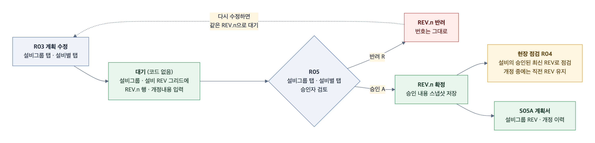

- 작성(R03) → 승인·반려(R05) 흐름은 지금과 같습니다.
- 새로 생기는 것은 REV 테이블, 승인 스냅샷, R03 두 탭의 REV 그리드입니다.
- 현장 점검(R04)은 '설비의 승인된 최신 REV' 내용으로 점검합니다.

---

## 3. 상태 코드와 REV 규칙

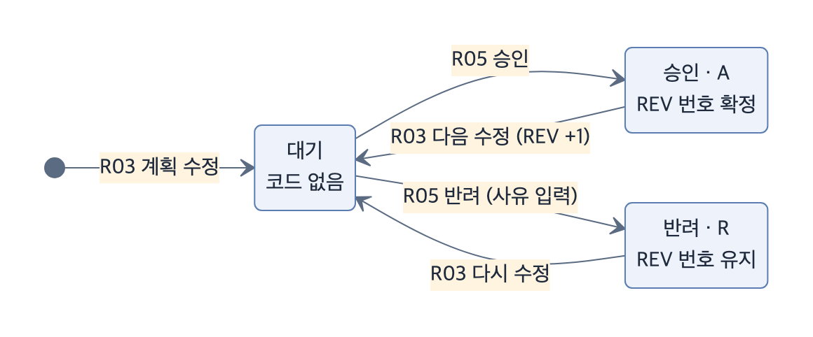

| 상태 | 코드 | 언제 | REV 번호 |
| --- | --- | --- | --- |
| 대기 | (없음) | R03에서 계획을 수정했을 때 | 진행 중인 번호 |
| 승인 | A | R05에서 승인했을 때 | 확정 |
| 반려 | R | R05에서 반려했을 때 | 그대로 유지 |

**공통 규칙**

- REV 번호는 설비그룹·설비마다 따로 붙고, 승인될 때 확정됩니다. REV.0이 제정입니다.
- 반려된 뒤 다시 수정하면 같은 번호로 다시 대기가 됩니다.
- 대상마다 진행 중인 REV(대기·반려)는 1개만 있습니다.
- 승인된 REV는 수정할 수 없습니다.

**설비그룹 ↔ 설비 연동**

| 동작 | 설비그룹 REV | 소속 설비 REV |
| --- | --- | --- |
| 설비그룹 탭에서 수정 | 대기 | 소속 설비 모두 대기 |
| 설비별 탭에서 수정 | 대기 (계획서 내용이 바뀜) | 그 설비만 대기 |
| 설비그룹 탭에서 승인·반려 | 승인·반려 | 대기 중인 소속 설비 REV도 같이 승인·반려 |
| 설비별 탭에서 승인·반려 | 변화 없음 (대기면 그대로) | 그 설비만 승인·반려 |

- 설비그룹 승인으로 함께 확정되는 설비 REV에 개정내용이 비어 있으면, 설비그룹 개정내용을 그대로 씁니다.
- 설비별 탭에서 설비만 승인하면 현장에는 바로 적용됩니다. 계획서는 설비그룹을 승인해야 새 REV로 출력됩니다.

**현장 점검 규칙**

- 설비그룹과 설비 모두 승인 REV가 있어야 점검할 수 있습니다. 지금과 같은 조건입니다.
- 점검 항목은 설비의 승인된 최신 REV에서 가져오며, 개정 중에는 직전 REV를 씁니다.
- 적용 REV는 **등록 팝업을 연 시점**에 정해집니다. 이미 등록한 실적은 새 REV가 승인돼도 원래 REV로 남습니다 (7-6).

---

## 4. 화면 구성

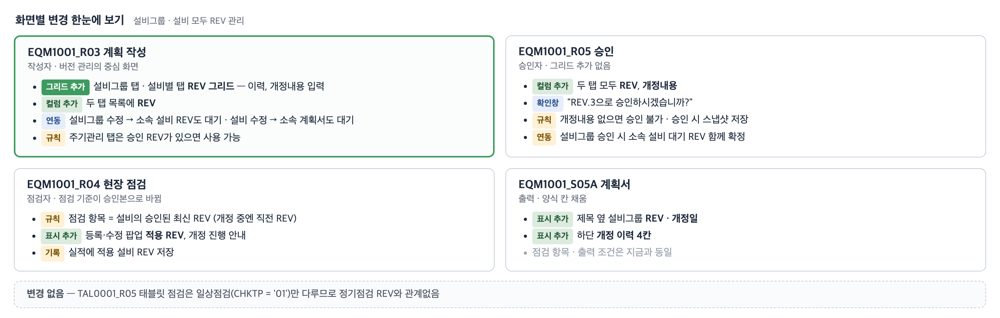

### 4-1. R03 설비그룹 탭 — REV 그리드 추가

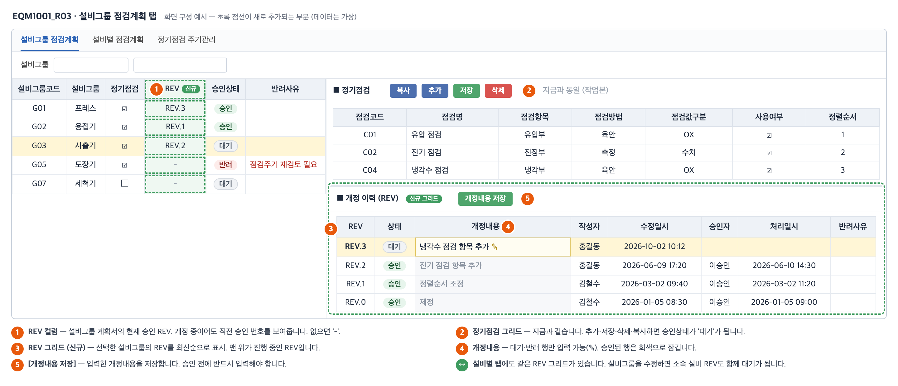

**배치**

- 우측 영역을 위아래로 나눕니다. 위는 지금의 정기점검 그리드, 아래는 새 **REV 그리드**입니다.
- 좌측 설비그룹 목록에 **REV** 컬럼(계획서 현재 승인 REV)을 추가합니다.

**REV 그리드 컬럼** (설비별 탭도 같음)

| 컬럼 | 필드 | 입력 | 설명 |
| --- | --- | --- | --- |
| REV | REVNM | - | REV.3 형식 |
| 상태 | APRVSTTNM | - | 대기 · 승인 · 반려 |
| 개정내용 | REVREMARK | 대기·반려 행만 | 무엇을 바꿨는지 |
| 작성자 | REQEMP | - | 마지막으로 수정한 사람 |
| 수정일시 | REQTIME | - | 마지막 수정 일시 |
| 승인자 | APRVEMP | - | 승인한 사람 |
| 처리일시 | APRVTIME | - | 승인·반려 일시 |
| 반려사유 | REJREASON | - | 반려됐을 때 표시 |
| (숨김) | REVNO · APRVSTT | - | 번호 · 상태 코드 |

**동작** (설비별 탭도 같음)

| 사용자 동작 | 화면 반응 |
| --- | --- |
| 좌측 목록에서 선택 | 정기점검 그리드와 REV 그리드를 함께 조회 |
| 정기점검 추가·저장·삭제·복사 | 승인상태가 '대기'로 바뀌고, REV 그리드 맨 위에 대기 행이 생기며 개정내용 칸으로 이동 |
| 개정내용 입력 후 [개정내용 저장] | 대기·반려 행의 개정내용 저장 |
| 승인된 행의 개정내용 클릭 | 편집되지 않음 (회색으로 잠김) |
| R05에서 반려된 뒤 조회 | 맨 위 행이 '반려', 반려사유가 빨간 글씨로 표시 |
| R05에서 승인된 뒤 조회 | 맨 위 행이 '승인', 좌측 REV 컬럼 번호 갱신 |

### 4-2. REV 그리드 상황별 화면

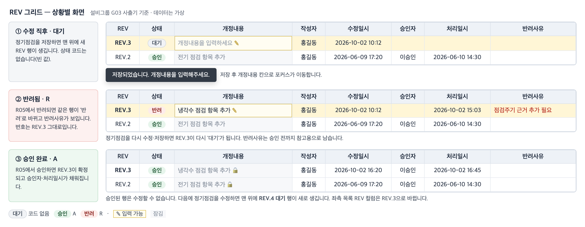

### 4-3. R03 설비별 탭 — 같은 REV 그리드

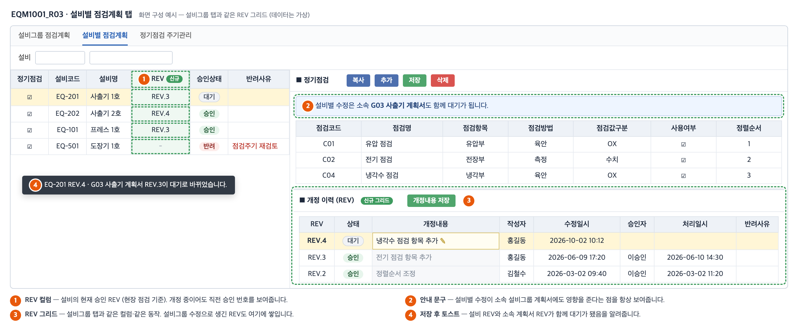

- 설비그룹 탭과 같은 위치·같은 컬럼으로 **REV 그리드**를 둡니다.
- 설비 목록에 **REV** 컬럼(설비 현재 승인 REV)을 추가합니다.
- "설비별 수정은 소속 설비그룹 계획서도 함께 대기가 됩니다" 안내를 항상 표시합니다.
- 설비그룹 수정으로 생긴 설비 REV도 이 그리드에 함께 쌓입니다.

### 4-4. R05 승인 — 두 탭 모두 컬럼 2개 추가

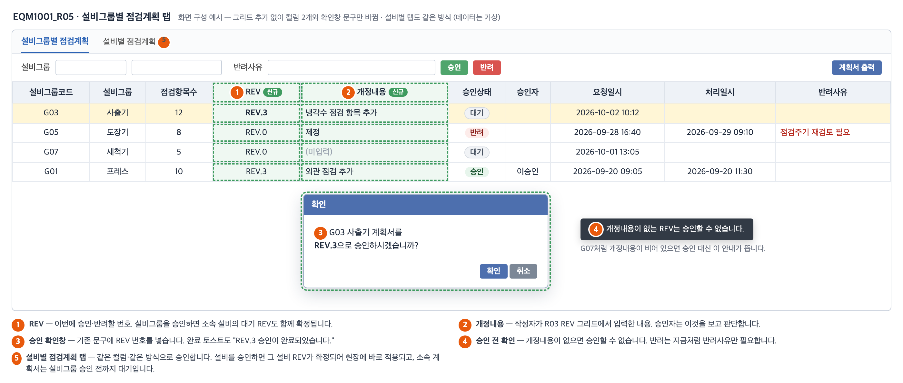

- 그리드는 추가하지 않습니다. 두 탭 목록에 **REV**와 **개정내용** 컬럼만 넣습니다.
- 승인 확인창과 완료 토스트에 REV 번호를 표시합니다.
- 개정내용이 없는 REV는 승인할 수 없습니다. 반려는 지금처럼 반려사유만 있으면 됩니다.
- 설비그룹을 승인·반려하면 대기 중인 소속 설비 REV도 함께 처리됩니다.

### 4-5. R04 현장 점검 — 적용 REV 표시

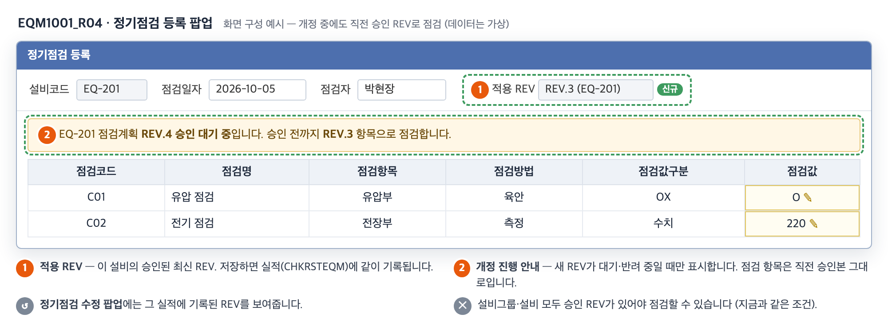

- 점검 항목은 설비의 승인된 최신 REV 스냅샷에서 가져옵니다. 작업 중인 수정 내용은 현장에 나오지 않습니다.
- 등록 팝업에 **적용 REV**를 표시합니다. 설비의 새 REV가 대기·반려 중이면 안내 문구를 보여줍니다.
- 저장할 때는 팝업을 열 때 쓴 REV 번호를 그대로 실적에 기록합니다. 수정 팝업에서는 기록된 REV를 보여줍니다.

### 4-6. S05A 계획서 — 개정 이력 채움

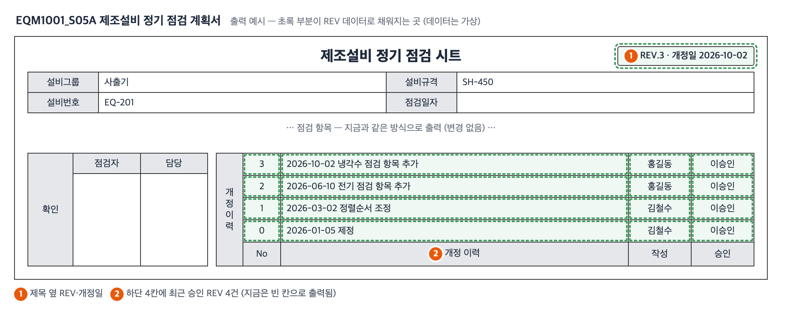

- 제목 옆에 설비그룹 REV 번호와 개정일(승인일)을 표시합니다.
- 하단 '개정 이력' 4칸에 설비그룹의 최근 승인 REV 4건을 채웁니다. 지금은 빈 칸으로 출력됩니다.
- 점검 항목과 출력 조건(설비그룹 승인 + 소속 설비 모두 승인)은 지금과 같습니다.

---

## 5. 사용 시나리오

설비별 탭에서 수정하고 설비그룹 탭에서 한 번에 승인하는 경우입니다.

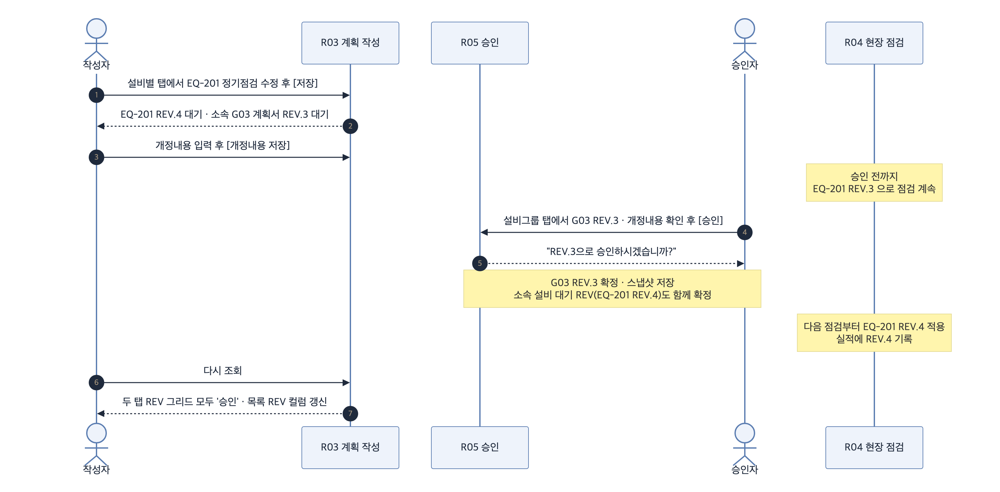

---

## 6. 이름 정하기

기존 코드의 `SavePlanStatus`, `ShowPlanReason`, `GetPlanTab`, `btn_GRP_APPROVE`, `pop1_find_EQMCD`와 같은 형식을 따릅니다 (`.agents/rules/coding_convention.md`).

### 6-1. 화면 컨트롤

| 화면 | 설비그룹 탭 | 설비별 탭 | 설명 |
| --- | --- | --- | --- |
| R03 | `grid_GRP_REV` | `grid_EQM_REV` | REV 그리드 |
| R03 | `btn_GRP_REV_SAVE` | `btn_EQM_REV_SAVE` | 개정내용 저장 버튼 |
| R03 | - | `lbl_EQM_REV_INFO` | 설비별 탭 안내 문구 |
| R04 | `pop1_txt_REVNM` · `pop2_txt_REVNM` | | 등록·수정 팝업 적용 REV (읽기 전용) |
| R04 | `pop1_txt_REVNO` | | 등록 팝업을 열 때의 REV 번호 (숨김, 저장 시 전달) |
| R04 | `pop1_lbl_REV_INFO` | | 개정 진행 안내 문구 |

### 6-2. 스크립트 함수

| 화면 | 함수 · 이벤트 | 역할 |
| --- | --- | --- |
| R03 | `SearchPlanRev(planTp, planCd)` | REV 그리드 조회 (G → `grid_GRP_REV`, E → `grid_EQM_REV`) |
| R03 | `SavePlanRev(planTp)` | 진행 중 REV의 개정내용 저장 |
| R03 | 두 REV 그리드의 `onBeginningEdit` | 승인된 행 편집 막기 |
| R03 | 좌측 목록 `onSelect`, 정기점검 저장 후 처리 (기존) | `SearchPlanRev` 호출 추가 |
| R05 | `SavePlanStatus` (기존) | 확인창·토스트 문구에 REV 번호 추가 |
| R04 | `ShowPlanRev()` | 팝업에 적용 REV와 개정 진행 안내 표시 |

- 변수는 `planTp`, `planCd`, `revNo`, `remark`, `aprvStt`, `gridId`처럼 짧게 씁니다.

### 6-3. 프로시저 분기 (CALLTYPE)

| 프로시저 | CALLTYPE | 구분 | 내용 |
| --- | --- | --- | --- |
| EQM1001_R05 | `LIST_PLAN_REV` | 신규 | REV 목록 조회 (설비그룹·설비) |
| EQM1001_R05 | `SAVE_PLAN_REV` | 신규 | 개정내용 저장 (대기·반려 REV만) |
| EQM1001_R05 | `REQUEST_PLAN` | 변경 | 수정 대상과 연동 대상의 대기 REV 생성 |
| EQM1001_R05 | `SAVE_PLAN_STATUS` | 변경 | REV 확정 + 스냅샷, 설비그룹이면 소속 설비 대기 REV 함께 처리, 개정내용 필수 |
| EQM1001_R05 | `LIST_PLAN` | 변경 | 두 탭 모두 REV·개정내용 추가 |
| EQM1001_R05 | `CALL_PLAN_RPT` | 변경 | 설비그룹 REV·개정일, 개정 이력 4건 추가 |
| EQM1001_R03 | `LIST_MSTEQM_GRP` · `LIST_MSTEQM` | 변경 | 현재 승인 REV 컬럼 추가 |
| EQM1001_R03 | `LIST` · `SAVE` · `DELETE_CYCLE_EQMCD` | 변경 | 승인 체크를 '설비그룹·설비 승인 REV 있음'으로 |
| EQM1001_R04 | `LIST_CYCLE_EQMCD` · `LIST_CHKPLANEQM_EQM02` | 변경 | 점검 대상·항목을 설비 승인 REV 스냅샷에서 조회 |
| EQM1001_R04 | `ADD_CHKRSTEQM` | 변경 | 팝업에서 받은 `$REVNO`가 승인 REV인지 확인 후 저장, 정렬순서도 그 REV 스냅샷에서 |
| EQM1001_R04 | `SEARCH` · `SAVE` · `DELETE_CHKRSTEQM` | 변경 | 승인 체크 변경, 조회 시 기록된 REV 표시 |

- REV 분기는 **EQM1001_R05**에 둡니다. 승인 테이블을 다루는 곳이 R05이고, R03도 이미 R05의 `REQUEST_PLAN`을 호출합니다.
- R05 프로시저 입력값에 `$REVREMARK VARCHAR(1000)`을 추가합니다.

---

## 7. 데이터 구조

### 7-1. 테이블 연결도

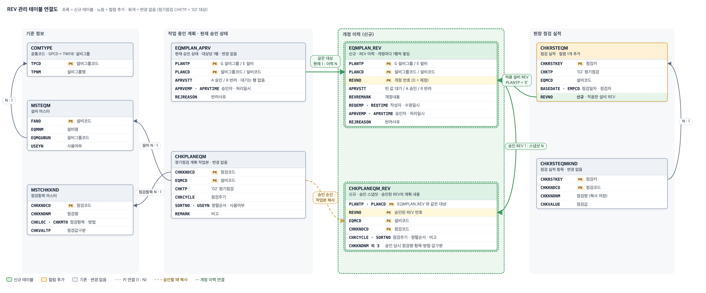

- 초록 영역의 **두 테이블이 신규**입니다. 기존 테이블은 `CHKRSTEQM`에 컬럼 1개만 추가합니다.
- 연결 기준
  - `EQMPLAN_APRV` ↔ `EQMPLAN_REV` — 같은 PLANTP · PLANCD. 현재 상태 1행 : 이력 N행
  - `EQMPLAN_REV` → `CHKPLANEQM_REV` — PLANTP · PLANCD · REVNO. 승인된 REV 1개 : 점검 항목 N행
  - `CHKPLANEQM` → `CHKPLANEQM_REV` — 승인하는 순간 작업본(정기점검 CHKTP = '02')을 복사
  - `CHKRSTEQM.REVNO` → `EQMPLAN_REV` — PLANTP = 'E', PLANCD = EQMCD, REVNO
- 스냅샷은 두 종류입니다.
  - 설비(E) REV: 그 설비의 점검 항목 → 현장 점검 기준
  - 설비그룹(G) REV: 소속 설비 전체의 점검 항목 → 계획서 보관본

### 7-2. 개정 이력이 쌓이는 방식

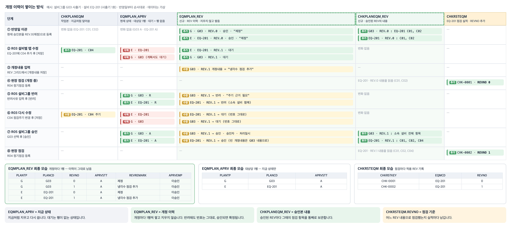

- `EQMPLAN_APRV`는 지금처럼 **현재 상태만** 가집니다 (지우고 다시 씀).
- `EQMPLAN_REV`는 개정마다 1행씩 **쌓기만** 합니다. 반려돼도 번호는 그대로이고, 승인되면 확정됩니다.
- `CHKPLANEQM_REV`는 승인된 REV마다 그때의 점검 항목을 통째로 보관합니다.
- `CHKRSTEQM.REVNO`로 실적마다 어느 REV 내용으로 점검했는지 남습니다.

### 7-3. 테이블 정의 (안)

전달해 주신 `CHKPLANEQM` · `CHKRSTEQM` · `MSTEQM` · `MSTCHKKND` 정의에 맞춰 타입과 문자셋(utf8)을 확정했습니다. 로컬 MariaDB 10.6에서 생성·컬럼 추가와 최대 길이 데이터 복사를 확인했습니다. 실제 파일은 `05.PROCEDURE/MES_SNS2_EQM1001_PLAN_REV.sql`로 만들고, 반영은 직접 진행합니다.

```sql
CREATE TABLE IF NOT EXISTS `MES_SNS2`.`EQMPLAN_REV` (
  `PLANTP`     CHAR(1)        NOT NULL COMMENT 'G: 설비그룹, E: 설비',
  `PLANCD`     VARCHAR(50)    NOT NULL COMMENT '설비그룹코드 또는 설비코드',
  `REVNO`      INT            NOT NULL COMMENT '개정 번호 (0: 제정)',
  `APRVSTT`    CHAR(1)        NOT NULL DEFAULT '' COMMENT '빈 값: 대기, A: 승인, R: 반려',
  `REVREMARK`  VARCHAR(1000)  NOT NULL DEFAULT '' COMMENT '개정내용',
  `REQTIME`    VARCHAR(19)    NOT NULL DEFAULT '' COMMENT '수정시간',
  `REQEMP`     VARCHAR(20)    NOT NULL DEFAULT '' COMMENT '작성자',
  `REQPRG`     VARCHAR(100)   NOT NULL DEFAULT '' COMMENT '수정프로그램',
  `APRVTIME`   VARCHAR(19)    NOT NULL DEFAULT '' COMMENT '승인·반려 처리시간',
  `APRVEMP`    VARCHAR(20)    NOT NULL DEFAULT '' COMMENT '승인자',
  `APRVPRG`    VARCHAR(100)   NOT NULL DEFAULT '' COMMENT '처리프로그램',
  `REJREASON`  VARCHAR(1000)  NOT NULL DEFAULT '' COMMENT '반려사유',
  `RTIME`      VARCHAR(19)    NOT NULL DEFAULT '' COMMENT '등록시간',
  `REMP`       VARCHAR(20)    NOT NULL DEFAULT '' COMMENT '등록자',
  `RPRG`       VARCHAR(100)   NOT NULL DEFAULT '' COMMENT '등록프로그램',
  `MTIME`      VARCHAR(19)    NOT NULL DEFAULT '' COMMENT '수정시간',
  `MEMP`       VARCHAR(20)    NOT NULL DEFAULT '' COMMENT '수정자',
  `MPRG`       VARCHAR(100)   NOT NULL DEFAULT '' COMMENT '수정프로그램',
  PRIMARY KEY (`PLANTP`, `PLANCD`, `REVNO`),
  KEY `IX_EQMPLAN_REV_STT` (`PLANTP`, `APRVSTT`, `PLANCD`)
) ENGINE=InnoDB DEFAULT CHARSET=utf8 COMMENT='설비 정기점검 계획 REV 이력';

CREATE TABLE IF NOT EXISTS `MES_SNS2`.`CHKPLANEQM_REV` (
  `PLANTP`     CHAR(1)        NOT NULL COMMENT 'G: 설비그룹, E: 설비',
  `PLANCD`     VARCHAR(50)    NOT NULL COMMENT '설비그룹코드 또는 설비코드',
  `REVNO`      INT            NOT NULL COMMENT '승인된 REV 번호',
  `EQMCD`      VARCHAR(20)    NOT NULL COMMENT '설비코드',
  `CHKKNDCD`   VARCHAR(20)    NOT NULL COMMENT '항목키',
  `CHKCYCLE`   VARCHAR(10)    NOT NULL DEFAULT '' COMMENT '점검주기',
  `SORTNO`     DECIMAL(20,0)  NOT NULL DEFAULT 0  COMMENT '순',
  `REMARK`     VARCHAR(1000)  NOT NULL DEFAULT '' COMMENT '비고',
  `CHKKNDNM`   VARCHAR(1000)  NOT NULL DEFAULT '' COMMENT '승인 당시 점검명',
  `CHKLOC`     VARCHAR(1000)  NOT NULL DEFAULT '' COMMENT '승인 당시 점검항목',
  `CHKMTH`     VARCHAR(1000)  NOT NULL DEFAULT '' COMMENT '승인 당시 점검방법',
  `CHKVALTP`   VARCHAR(10)    NOT NULL DEFAULT '' COMMENT '승인 당시 점검값구분',
  `RTIME`      VARCHAR(19)    NOT NULL DEFAULT '' COMMENT '등록시간',
  `REMP`       VARCHAR(20)    NOT NULL DEFAULT '' COMMENT '등록자',
  `RPRG`       VARCHAR(100)   NOT NULL DEFAULT '' COMMENT '등록프로그램',
  PRIMARY KEY (`PLANTP`, `PLANCD`, `REVNO`, `EQMCD`, `CHKKNDCD`)
) ENGINE=InnoDB DEFAULT CHARSET=utf8 COMMENT='설비 정기점검 계획 승인 스냅샷';

ALTER TABLE `MES_SNS2`.`CHKRSTEQM`
  ADD COLUMN `REVNO` INT NULL DEFAULT NULL COMMENT '적용 설비 REV' AFTER `CHKCYCLE`;
```

- `CHKPLANEQM`의 기본키가 (CHKKNDCD, EQMCD)라서 스냅샷 키도 설비 · 점검항목 기준으로 잡았습니다. CHKTP는 키가 아니므로 정기점검('02') 행만 복사합니다.
- 점검명 · 점검항목 · 점검방법 · 점검값구분은 `MSTCHKKND`와 같은 길이(1000 · 1000 · 1000 · 10)입니다. 점검주기 · 정렬순서 · 비고는 복사 원본인 `CHKPLANEQM`과 같습니다.
- `MSTEQM` · `MSTCHKKND` · `CHKPLANEQM` · `CHKRSTEQM`이 모두 utf8이라 신규 테이블도 utf8로 맞췄습니다. 설비코드(FANO varchar(50))와 설비그룹코드(EQMGUBUN varchar(10))는 `PLANCD VARCHAR(50)`에 들어갑니다.
- `CHKRSTEQM.REVNO`는 기존 실적과 일상점검(CHKTP = '01') 실적에서는 NULL로 남습니다.
- `EQMPLAN_APRV`는 구조와 저장 로직을 그대로 두고, 점검 가능 여부 판단에는 더 이상 쓰지 않습니다. DDL 주석의 `P: 대기`와 기본값 `'P'`는 실제로 쓰지 않으므로 정리를 권장합니다 (선택).

### 7-4. 점검 등록 때 적용 REV 가져오기

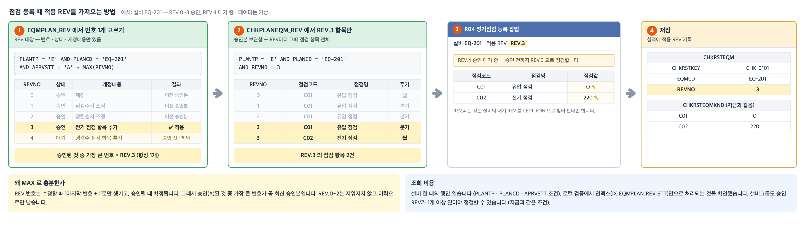

`EQMPLAN_REV`에는 REV.0부터 모든 번호가 쌓이지만, 점검 등록에서 쓰는 것은 **설비당 1개**뿐입니다.

1. `EQMPLAN_REV`에서 그 설비(PLANTP = 'E')의 **승인(A) REV 중 가장 큰 번호**를 고릅니다.
   - REV.0~2는 이력으로만 남습니다.
   - 대기·반려 중인 REV.4는 승인 전이라 빠집니다.
2. `CHKPLANEQM_REV`에서 **그 번호의 점검 항목만** 가져와 팝업에 표시합니다.
3. 대기·반려 REV가 있으면 LEFT JOIN으로 찾아 "REV.4 승인 대기 중" 안내만 보여줍니다.
4. 저장할 때 `CHKRSTEQM.REVNO`에 적용한 번호를 기록합니다.

- REV 번호는 수정할 때 '마지막 번호 + 1'로만 생기고 승인될 때 확정되므로, 승인된 것 중 가장 큰 번호가 곧 최신 승인본입니다.
- 설비 한 대의 행만 읽으며, 로컬 검증에서 인덱스(`IX_EQMPLAN_REV_STT`)만으로 처리되는 것을 확인했습니다. 쿼리는 부록에 있습니다.

### 7-5. `CHKPLANEQM_REV`가 필요한 이유

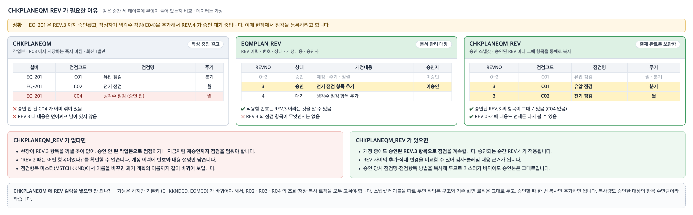

- `CHKPLANEQM`(작업본)은 R03에서 저장하는 즉시 바뀝니다. 승인 전 내용이 섞이고, 이전 내용은 남지 않습니다.
- `EQMPLAN_REV`(REV 대장)에는 번호 · 상태 · 개정내용 · 승인자만 있고 **점검 항목은 없습니다.**
- 그래서 "승인된 REV.3의 점검 항목"은 `CHKPLANEQM_REV`에만 남습니다. 이 테이블로 다음 세 가지를 합니다.
  - 개정 중에도 승인본으로 현장 점검
  - 과거 REV 조회 · 비교
  - 점검항목 마스터가 바뀌어도 승인본 유지

### 7-6. 점검 도중 새 REV가 승인되면

적용 REV는 **등록 팝업을 연 시점**에 정해지고, 저장할 때 그 번호를 그대로 기록합니다.

| 상황 | 적용 REV | 이유 |
| --- | --- | --- |
| REV.4 승인 전에 이미 저장한 실적 | REV.3 그대로 | 실적 항목은 `CHKRSTEQMKND`에 복사돼 있어 수정 팝업도 REV.3 내용을 보여줌 |
| REV.3으로 팝업을 연 뒤, 저장 전에 REV.4 승인 | REV.3으로 저장 | 실제로 REV.3 항목으로 점검했으므로 그대로 기록 |
| REV.4 승인 뒤 새로 여는 등록 | REV.4 | 그 시점의 승인된 최신 REV |
| REV.3 실적을 삭제하고 다시 등록 | REV.4 | 새 등록으로 보고 그 시점의 REV 적용 |

- 저장할 때 REV를 다시 계산하지 않습니다. 다시 계산하면 REV.3 항목으로 점검했는데 실적에는 REV.4가 기록될 수 있습니다.
- `ADD_CHKRSTEQM`은 받은 번호가 그 설비의 승인 REV인지 확인하고, 정렬순서도 작업본이 아닌 그 REV의 스냅샷에서 가져옵니다. 지금은 작업본(`CHKPLANEQM`)에서 읽고 있어 개정 중에 값이 달라질 수 있습니다.
- 로컬 MariaDB에서 네 경우를 확인했습니다. 저장 전 승인, 새 등록, 승인 안 된 REV로 저장 시도(차단)도 포함합니다.

---

## 8. 기존 계획 이관 (REV.0 제정)

이관 직후 현장 점검 가능 범위가 **지금과 똑같도록** 맞췄습니다.

| 대상 | 현재 상태 | 이관 결과 |
| --- | --- | --- |
| 설비 | 승인 | 설비 REV.0 승인 + 스냅샷 |
| 설비 | 대기 · 반려 | 설비 REV.0 대기 · 반려 (반려사유 복사) |
| 설비그룹 | 승인, 소속 설비 모두 승인 | 설비그룹 REV.0 승인 + 스냅샷 |
| 설비그룹 | 승인, 일부 설비 미승인 | 설비그룹 REV.0 승인 (승인된 설비만 스냅샷) + REV.1 대기 |
| 설비그룹 | 대기 · 반려 | 설비그룹 REV.0 대기 · 반려 (반려사유 복사) |

- REV.0의 개정내용은 '제정'으로 넣고, 승인자·승인일은 `EQMPLAN_APRV` 값을 그대로 옮깁니다.
- 결과적으로 설비그룹·설비가 모두 승인된 설비만 점검할 수 있습니다. 지금과 같습니다.

---

## 9. 진행 순서

| 순서 | 작업 |
| --- | --- |
| 1 | DB: `MES_SNS2_EQM1001_PLAN_REV.sql` (테이블 2개, `CHKRSTEQM.REVNO`), 이관 스크립트 |
| 2 | R05 프로시저: REV 분기 추가·변경 |
| 3 | R03 화면·프로시저: 두 탭 REV 그리드, 목록 REV 컬럼, 설비별 안내, 주기관리 체크 |
| 4 | R05 화면: 두 탭 컬럼 2개, 확인창 문구 |
| 5 | R04 화면·프로시저: 설비 승인 REV 기준 점검, 적용 REV 표시·기록 |
| 6 | S05A 계획서 + `CALL_PLAN_RPT`: REV·개정 이력 |

- **1~5는 같은 날 반영**합니다.
  - R04를 늦게 반영하면 설비 하나를 수정할 때 소속 계획서가 대기가 되어 그룹 전체 점검이 멈춥니다.
  - R04만 먼저 반영하면 새로 승인한 내용이 현장에 반영되지 않습니다.
- 반영 순서는 이관 스크립트 → 프로시저 → 화면입니다. 이관 후 "승인 REV가 없는 승인 설비 0건"을 확인합니다.
- 6번은 출력 내용만 추가하므로 따로 반영해도 됩니다.
- 새 테이블·컬럼은 추가만 하므로 문제가 생기면 프로시저와 화면만 되돌리면 됩니다.
- `TAL0001_R05`(태블릿 점검)는 일상점검(CHKTP = '01')만 다루므로 이번 변경 대상이 아닙니다.

---

## 10. 검증 결과와 확인 요청

**로컬 MariaDB 10.6에서 확인한 내용**

- 이관: 설비그룹·설비 REV.0이 위 표대로 만들어지고, 점검 가능 설비가 지금과 같음
- 설비별 탭 수정 → 설비 REV 대기 + 소속 계획서 REV 대기, 현장은 직전 REV로 계속 점검
- 설비별 탭 승인 → 그 설비 REV만 확정, 현장에 바로 적용, 계획서는 대기 유지
- 설비그룹 탭 수정 → 소속 설비 REV도 함께 대기 (반려·대기였던 REV는 같은 번호 유지)
- 설비그룹 승인 → 계획서 REV 확정 + 소속 설비 대기 REV 함께 확정, 빈 개정내용은 설비그룹 내용으로 채움
- 설비그룹 반려 → 소속 설비 대기 REV도 반려, 현장은 직전 REV 유지
- 반려 후 다시 수정 → 같은 번호로 대기
- 개정내용 없는 승인, 대기 REV 없는 승인은 오류로 막힘

**확인 요청 자료**

- [x] `CHKPLANEQM` · `CHKRSTEQM` 정의 — 7-3 테이블 정의에 반영
- [x] `TAL0001_R05` 프로시저 소스 — 일상점검 전용이라 변경 대상 아님
- [x] `MSTEQM` · `MSTCHKKND` 정의 — 7-3 컬럼 길이·문자셋 확정

요청드릴 자료는 더 없습니다. 구현을 시작할 수 있는 상태입니다.

---

## 부록. 코드 예시

네이밍과 구조를 보여주기 위한 예시입니다. 실제 작업할 때 날짜 주석은 작업일로 씁니다. SQL은 같은 로직을 로컬 MariaDB 10.6에서 실행해 확인했습니다.

### R03 스크립트 — REV 그리드

```javascript
// YYYY-MM-DD [설비그룹 점검계획 탭 개정 이력] REV 그리드 초기화 (설비별 탭 grid_EQM_REV 도 같은 컬럼)
ItsGrid.Create('grid_GRP_REV', { isCheckBoxGrid: false, isSubTotalGrid: false }, [
    column.create('REV', 'REVNM', { width: 70, align: 'center', readOnly: true }),
    column.create('상태', 'APRVSTTNM', { width: 60, align: 'center', readOnly: true }),
    column.create('개정내용', 'REVREMARK', { width: 260 }),
    column.create('작성자', 'REQEMP', { width: 80, align: 'center', readOnly: true }),
    column.create('수정일시', 'REQTIME', { width: 130, align: 'center', readOnly: true }),
    column.create('승인자', 'APRVEMP', { width: 80, align: 'center', readOnly: true }),
    column.create('처리일시', 'APRVTIME', { width: 130, align: 'center', readOnly: true }),
    column.create('반려사유', 'REJREASON', { width: 200, readOnly: true }),
    column.create('REV번호', 'REVNO', { hidden: true }),
    column.create('상태코드', 'APRVSTT', { hidden: true }),
    column.split()
]);

// YYYY-MM-DD [설비그룹 점검계획 탭 개정 이력] 승인된 REV 행은 개정내용 수정 불가
ItsGrid.Event('grid_GRP_REV').onBeginningEdit = function (rowIndex, field, value) {
    if (ItsGrid.GetValue('grid_GRP_REV', rowIndex, 'APRVSTT') == 'A') {
        throw '';
    }
};

// YYYY-MM-DD [점검계획 개정 이력] 선택 설비그룹·설비의 REV 목록 조회
function SearchPlanRev(planTp, planCd) {
    var gridId = planTp == 'G' ? 'grid_GRP_REV' : 'grid_EQM_REV';
    var maria = new ItsMaria('EQM1001_R05', 'LIST_PLAN_REV');
    maria.AddParam('PLANTP', planTp);
    maria.AddParam('PLANCD', planCd);
    maria.CallProc();
    if (maria.isError) {
        maria.ShowErrMsg();
        return;
    }

    ItsGrid.SetStore(gridId, maria.store);
}
```

### R05 프로시저 — REQUEST_PLAN에 추가 (연동 대기 REV 생성)

수정 대상과 연동 대상(설비그룹이면 소속 설비, 설비면 소속 설비그룹)을 한 번에 처리합니다.

```sql
-- 반려·대기 REV 는 다시 대기로
UPDATE EQMPLAN_REV
INNER JOIN (
  SELECT $PLANTP AS PLANTP, $PLANCD AS PLANCD
  UNION ALL
  SELECT 'E', MSTEQM.FANO FROM MSTEQM WHERE $PLANTP = 'G' AND MSTEQM.EQMGUBUN = $PLANCD AND MSTEQM.USEYN = 'Y'
  UNION ALL
  SELECT 'G', MSTEQM.EQMGUBUN FROM MSTEQM WHERE $PLANTP = 'E' AND MSTEQM.FANO = $PLANCD
) PLAN_KEY
  ON PLAN_KEY.PLANTP = EQMPLAN_REV.PLANTP
 AND PLAN_KEY.PLANCD = EQMPLAN_REV.PLANCD
SET EQMPLAN_REV.APRVSTT = '',
    EQMPLAN_REV.REQTIME = CALLTIME(), EQMPLAN_REV.REQEMP = CALLEMP(), EQMPLAN_REV.REQPRG = CALLPRG(),
    EQMPLAN_REV.MTIME = CALLTIME(), EQMPLAN_REV.MEMP = CALLEMP(), EQMPLAN_REV.MPRG = CALLPRG()
WHERE EQMPLAN_REV.APRVSTT <> 'A';

-- 마지막 REV 가 승인이거나 없으면 다음 번호로 대기 REV 생성
INSERT INTO EQMPLAN_REV (PLANTP, PLANCD, REVNO, APRVSTT, REQTIME, REQEMP, REQPRG, RTIME, REMP, RPRG)
SELECT PLAN_KEY.PLANTP, PLAN_KEY.PLANCD, COALESCE(LAST_REV.REVNO + 1, 0), '',
       CALLTIME(), CALLEMP(), CALLPRG(), CALLTIME(), CALLEMP(), CALLPRG()
FROM (
  SELECT $PLANTP AS PLANTP, $PLANCD AS PLANCD
  UNION ALL
  SELECT 'E', MSTEQM.FANO FROM MSTEQM WHERE $PLANTP = 'G' AND MSTEQM.EQMGUBUN = $PLANCD AND MSTEQM.USEYN = 'Y'
  UNION ALL
  SELECT 'G', MSTEQM.EQMGUBUN FROM MSTEQM WHERE $PLANTP = 'E' AND MSTEQM.FANO = $PLANCD
) PLAN_KEY
LEFT JOIN (
  SELECT EQMPLAN_REV.PLANTP, EQMPLAN_REV.PLANCD, MAX(EQMPLAN_REV.REVNO) AS REVNO
  FROM EQMPLAN_REV
  GROUP BY EQMPLAN_REV.PLANTP, EQMPLAN_REV.PLANCD
) LAST_REV
  ON LAST_REV.PLANTP = PLAN_KEY.PLANTP
 AND LAST_REV.PLANCD = PLAN_KEY.PLANCD
LEFT JOIN EQMPLAN_REV LAST_ROW
  ON LAST_ROW.PLANTP = LAST_REV.PLANTP
 AND LAST_ROW.PLANCD = LAST_REV.PLANCD
 AND LAST_ROW.REVNO = LAST_REV.REVNO
WHERE LAST_ROW.APRVSTT IS NULL
   OR LAST_ROW.APRVSTT = 'A';
```

### R04 프로시저 — 설비 승인 REV 기준 점검 항목 (LIST_CHKPLANEQM_EQM02)

WHERE 절 상관 서브쿼리 없이 미리 묶은 뒤 JOIN합니다 (프로시저 규칙 0-1). 서브쿼리 안에서도 설비코드로 걸러 설비 한 대의 행만 읽습니다.

```sql
SELECT
  MSTEQM.FANO AS EQMCD,
  EQM_REV.REVNO,
  CONCAT('REV.', EQM_REV.REVNO) AS REVNM,
  COALESCE(CONCAT('REV.', EQM_PEND.REVNO), '') AS PENDREVNM,
  CHKPLANEQM_REV.CHKKNDCD,
  CHKPLANEQM_REV.CHKKNDNM,
  CHKPLANEQM_REV.CHKLOC,
  CHKPLANEQM_REV.CHKMTH,
  CHKPLANEQM_REV.CHKVALTP,
  CHKPLANEQM_REV.CHKCYCLE,
  '' AS CHKVALUE
FROM MSTEQM
INNER JOIN (
  SELECT EQMPLAN_REV.PLANCD, MAX(EQMPLAN_REV.REVNO) AS REVNO
  FROM EQMPLAN_REV
  WHERE EQMPLAN_REV.PLANTP = 'E'
    AND EQMPLAN_REV.PLANCD = $EQMCD
    AND EQMPLAN_REV.APRVSTT = 'A'
  GROUP BY EQMPLAN_REV.PLANCD
) EQM_REV
  ON EQM_REV.PLANCD = MSTEQM.FANO
INNER JOIN (
  SELECT EQMPLAN_REV.PLANCD
  FROM EQMPLAN_REV
  WHERE EQMPLAN_REV.PLANTP = 'G'
    AND EQMPLAN_REV.APRVSTT = 'A'
  GROUP BY EQMPLAN_REV.PLANCD
) GRP_REV
  ON GRP_REV.PLANCD = MSTEQM.EQMGUBUN
LEFT JOIN EQMPLAN_REV EQM_PEND
  ON EQM_PEND.PLANTP = 'E'
 AND EQM_PEND.PLANCD = MSTEQM.FANO
 AND EQM_PEND.APRVSTT <> 'A'
INNER JOIN CHKPLANEQM_REV
  ON CHKPLANEQM_REV.PLANTP = 'E'
 AND CHKPLANEQM_REV.PLANCD = MSTEQM.FANO
 AND CHKPLANEQM_REV.REVNO = EQM_REV.REVNO
WHERE MSTEQM.USEYN = 'Y'
  AND MSTEQM.FANO = $EQMCD
ORDER BY CHKPLANEQM_REV.SORTNO;
```
